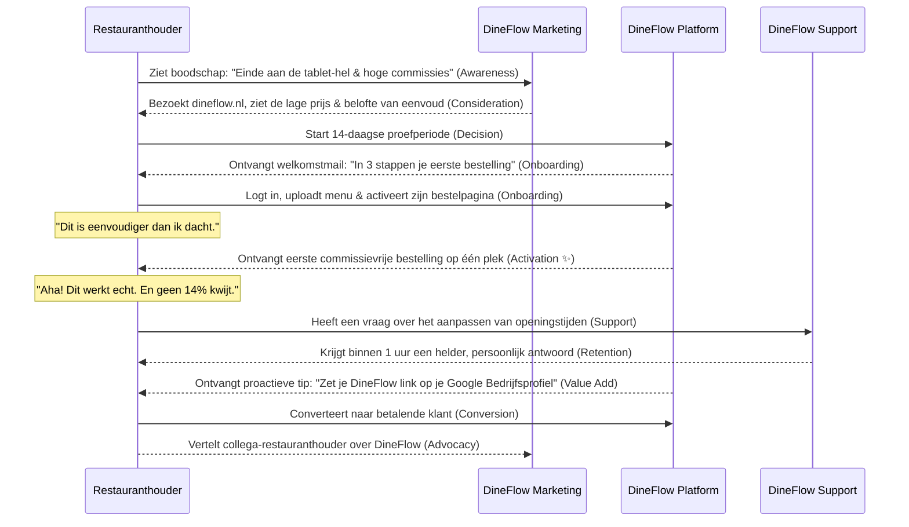
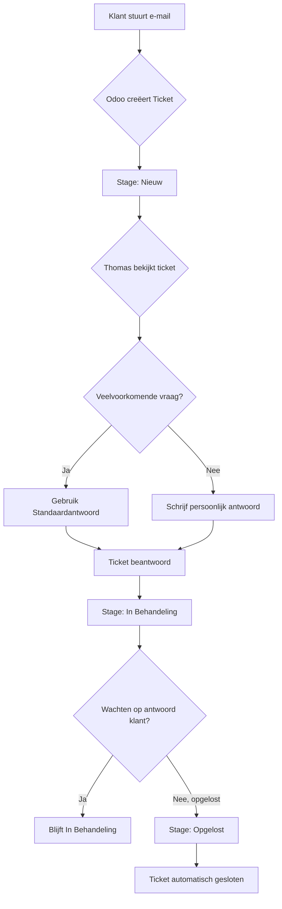

---

# **Project Catalyst Strategisch Actieplan: DineFlow**

**Datum:** 5 augustus 2025
**Opdrachtgever:** Thomas, Mede-oprichter DineFlow
**Consultant:** Project Catalyst

## **1. Inleiding & Project Briefing**

Dit document dient als het strategische fundament en operationele playbook voor de marktintroductie van DineFlow. Het doel is om de initiële, complexe uitdagingen van marketing en klantenservice te vertalen naar een reeks concrete, uitvoerbare stappen.

#### **Project Context (Input van Thomas):**

> "Ik ben een bedrijf begonnen samen met mijn maatje. Hij heeft het op zich genomen om een soort Sitedish SaaS-platform te bouwen voor Nederlandse restaurants. Het MVP-product is een multi-tenant SAAS-platform waar restaurants een trail kunnen starten voor 14 dagen en vanaf daarna voor ongeveer 25 euro per maand en 30 cent per transactie hun eigen menu, foto's en dergelijke informatie kunnen uploaden. Ze kunnen dan hun producten online zetten onder een subdomein (slug.dineflow.nl). We zijn dit bedrijf gestart omdat we de commissiepercentages van Thuisbezorgd etc. veel te hoog vinden en willen dus echt oprecht de restaurant-eigenaren helpen. Mijn naam is Thomas, ik ben 29 jaar en ik wil me gaan verdiepen in het stukje marketing en het efficiënt opzetten van een customer service omgeving. Ik heb nog totaal geen ervaring met deze onderwerpen."

#### **Lange Termijn Visie:**

> "Uiteindelijk willen we ook een POS, delivery systeem, KDS bouwen, en bonnenprinters en schermen leveren. Dus uiteindelijk alles kunnen leveren wat een restaurant nodig zou kunnen hebben."

#### **Technische Stack:**

*   **DineFlow Applicatie:** Gebouwd op Next.js, gehost op Vercel met Supabase als backend.
*   **Interne Bedrijfsvoering:** Odoo wordt gebruikt voor de eigen administratie, CRM en klantenservice.

---

## **2. Prompt 1: Ideal Customer Profile (ICP)**

Dit profiel is ons kompas. Het beschrijft de restauranthouder die we als eerste en beste kunnen helpen.

### **Profielnaam: "De Pragmatische Vechter"**

"De Pragmatische Vechter" is gepassioneerd over zijn zaak, maar vecht dagelijks tegen externe druk en zoekt naar slimme, praktische oplossingen die direct resultaat opleveren.

#### **Demografie & Bedrijfstype**
*   **Profiel:** Eigenaar van een zelfstandig restaurant, pizzeria, sushibar, snackbar of eetcafé.
*   **Focus:** Sterke focus op afhaal- en bezorgmaaltijden als significant deel van de omzet.
*   **Team:** Een klein, hecht team waar de eigenaar zelf meewerkt en de eindverantwoordelijkheid draagt.

#### **Technologiegebruik & Werkstroom**
*   **De "Tablet-Hel":** Het zenuwcentrum voor online bestellingen is een hoek op de toonbank met meerdere tablets (Thuisbezorgd, Uber Eats), elk met een eigen geluid en printer. Dit is een bron van constante stress en operationele chaos.
*   **Kassasysteem (POS):**
    *   **Meest Voorkomend:** Een eenvoudige, losstaande kassa. Bestellingen van de tablets worden handmatig overgetikt.
    *   **Minder Voorkomend:** Een moderner POS-systeem, maar zonder integratie met de bestelplatformen. Ook hier worden bestellingen handmatig overgezet.
*   **Conclusie:** De online bestelstroom is **altijd losgekoppeld** van de centrale administratie.

#### **Top 4 Pijnpunten**
1.  **Commissie-Kosten:** Het afdragen van 14-30% van de omzet per bestelling.
2.  **Operationele Chaos:** De stress en foutgevoeligheid van het managen van de "tablet-hel".
3.  **Verlies van Klantdata:** Geen eigenaar zijn van klantgegevens, wat directe marketing onmogelijk maakt.
4.  **Gebrek aan Autonomie:** Volledig afhankelijk zijn van de regels en algoritmes van externe platformen.

---

## **3. Prompt 2: Waardepropositie & Kernboodschappen**

Dit is *wat* we "De Pragmatische Vechter" vertellen. De boodschap is direct afgestemd op zijn pijnpunten.

### **Waardepropositie**

> **DineFlow geeft Nederlandse restaurants de controle terug met één betaalbaar platform dat de operationele chaos van vandaag oplost en meegroeit naar een volledig geïntegreerd systeem voor morgen.**

### **Kernboodschappen**

| Pijnpunt Klant | DineFlow Oplossing | Kernboodschap (voor marketing) |
| :--- | :--- | :--- |
| **1. Commissie-Kosten** | Vast, laag maandbedrag (€25) + minimale transactiefee (€0.30). | "Stop met het weggeven van je winst. Met DineFlow houd je tot 30% meer over per bestelling." |
| **2. Operationele Chaos ("Tablet-Hel")** | Eén overzichtelijk systeem om online bestellingen te ontvangen. | "Vervang je 'tablet-hel' door één overzichtelijk systeem. Meer rust in de zaak, minder fouten tijdens de spits." |
| **3. Verlies van Klantdata** | 100% eigenaar van alle klantdata en de bestelomgeving. | "Jouw klanten, jouw data. Bouw een directe relatie op en maak van eenmalige bestellers je meest trouwe fans." |
| **4. Gebrek aan Autonomie & Toekomstperspectief** | Een onafhankelijk platform, ontworpen om uit te groeien tot een compleet ecosysteem. | "Start vandaag slim en bouw aan de toekomst. DineFlow is de strategische partner die meegroeit met jouw ambitie." |

---

## **4. Prompt 3: De Klantreis**

Dit is de visualisatie van de reis die onze klant aflegt, van frustratie naar ambassadeurschap.

### **Visualisatie van de Klantreis**

### **Fases & Kritieke Succesmomenten**
1.  **Awareness:** De boodschap wordt herkend als een directe afspiegeling van de dagelijkse frustratie.
2.  **Consideration:** De website is helder, de prijs is transparant en de belofte van eenvoud is overtuigend.
3.  **Onboarding:** De klant ervaart dat het opzetten van zijn pagina verrassend eenvoudig is, wat een gevoel van controle geeft.
4.  **Activation (✨ Het 'Aha!'-moment):** De klant ontvangt de eerste commissievrije bestelling en ervaart de dubbele winst: financieel en operationeel.
5.  **Support:** De klant ervaart dat de support snel, persoonlijk en deskundig is, wat vertrouwen bouwt.
6.  **Value Add:** De klant realiseert zich dat DineFlow proactief meedenkt over zijn succes.
7.  **Conversion & Advocacy:** De waarde is zo overduidelijk bewezen dat betalen een 'no-brainer' is en de klant een ambassadeur wordt.

---

## **5. Prompt 4: Customer Service Werkstroom in Odoo**

Dit is de blauwdruk voor jouw efficiënte klantenservice-motor.

### **Visualisatie van de Ticket-Workflow (GECORRIGEERDE SYNTAX)**

### **Stapsgewijze Configuratie in Odoo**
1.  **Installeer Odoo Apps:** Zorg dat `Helpdesk` en `Contacten` geïnstalleerd zijn.
2.  **Configureer Helpdesk Team:**
    *   Maak team "**DineFlow Support**" aan via `Configuratie` > `Helpdesk Teams`.
    *   Stel de e-mailalias in op `support@dineflow.nl`. Alle mails naar dit adres worden automatisch tickets.
3.  **Definieer Ticket Fases (Stages):**
    *   **Nieuw:** Voor alle inkomende tickets.
    *   **In Behandeling:** Tickets die je hebt opgepakt.
    *   **Opgelost:** Tickets die zijn afgehandeld.
    *   **Gesloten:** Tickets die definitief zijn gearchiveerd.
4.  **Creëer Essentiële Standaardantwoorden:**
    *   Ga naar `Configuratie` > `Standaardantwoorden` en maak templates aan voor de meest voorkomende vragen.
    *   **Voorbeeld 1: Hoe upload ik mijn menu?**
        > "Beste {{ object.customer_id.name }}, goed dat je dit vraagt! Het uploaden van je menu is heel eenvoudig. Volg deze stappen: 1. Log in op je DineFlow dashboard. 2. Ga naar 'Menu Beheer'. 3. Klik op 'Categorie Toevoegen' (bv. 'Voorgerechten'). 4. Klik op 'Gerecht Toevoegen' en vul de details in. Hier is een korte video die het laat zien: [link naar toekomstige instructievideo]."
    *   **Voorbeeld 2: Proefperiode loopt af**
        > "Beste {{ object.customer_id.name }}, je gratis proefperiode loopt binnenkort af. We hopen dat je de voordelen van DineFlow hebt ervaren! Om ongestoord bestellingen te blijven ontvangen, kun je hier je abonnement activeren: [directe link naar betaalpagina]. Als je nog vragen hebt, stel ze gerust!"

---

## **6. Prompt 5: Go-To-Market Strategie (Eerste 10 Klanten)**

Dit is het concrete actieplan om van nul naar tien klanten te gaan.

### **Tactiek 1: De Hyper-Lokale "Wandel & Bel" Aanpak**

*   **Aanpak:**
    1.  **Selectie:** Maak een lijst van 20-30 lokale restaurants die passen bij het ICP.
    2.  **Onderzoek:** Doe 5 minuten research per restaurant (website, huidige bestelmodule).
    3.  **Eerste Contact:** Loop langs op een rustig tijdstip (bv. dinsdag 15:00). Vraag niet naar de eigenaar, maar laat een boodschap achter en vraag naar het beste contactmoment/e-mailadres.
    4.  **Opvolging:** Bel of mail op het aangegeven moment met een hyper-persoonlijke boodschap.
*   **Benodigde Tools:** Google Maps, notitieblok, professioneel e-mailadres.
*   **Concept E-mail:**
    > **Onderwerp:** Vraag over online bestellen bij [Naam Restaurant]
    >
    > "Beste [Naam Eigenaar],
    >
    > Mijn naam is Thomas, mede-oprichter van DineFlow, een nieuw platform uit de regio.
    >
    > Ik zie dat jullie [fantastische pizza's/sushi/etc.] aanbieden. Ik zie ook dat jullie gebruikmaken van [Thuisbezorgd/geen eigen module]. Wij weten dat de commissies en de operationele chaos van die systemen een enorme last zijn.
    >
    > DineFlow is het eerlijke alternatief: geen 14-30% commissie, maar een vast laag bedrag. Eén overzichtelijk systeem, volledige controle over je eigen klanten en binnen 15 minuten live.
    >
    > Zou je openstaan voor een vrijblijvende online demo van 10 minuten volgende week? Dan laat ik je zien hoeveel je per maand kunt besparen.
    >
    > Met vriendelijke groet,
    > Thomas | DineFlow"
*   **KPI:** Aantal geplande demo's.

### **Tactiek 2: De LinkedIn "Slimme Helper" Aanpak**

*   **Aanpak:**
    1.  **Optimaliseer je Profiel:** Kopregel: "Mede-oprichter bij DineFlow | Ik help Nederlandse restaurants hun winstmarge te verhogen."
    2.  **Zoeken & Verbinden:** Zoek op "Eigenaar" in de sector "Restaurants" (NL). Stuur connectieverzoeken zonder verkooppraatje.
    3.  **Waardevolle Interactie:** Stuur na acceptatie een bericht waarin je een oprechte vraag stelt, geen pitch.
*   **Benodigde Tools:** LinkedIn-account.
*   **Concept Eerste Bericht:**
    > "Hoi [Naam Eigenaar], bedankt voor het verbinden! Ik zag dat je eigenaar bent van [Naam Restaurant], ziet er goed uit. Ik ben zelf DineFlow gestart omdat ik me ergerde aan de wurggreep van de grote platformen. Ik ben benieuwd, wat is op dit moment jouw grootste uitdaging op het gebied van online bestellingen? De hoge commissies of meer de operationele rompslomp?"
*   **KPI:** Aantal betekenisvolle gesprekken gestart.

---

Dit document is jouw blauwdruk voor succes. Door deze stappen systematisch te volgen, bouw je een solide bedrijf op een sterk strategisch fundament.
