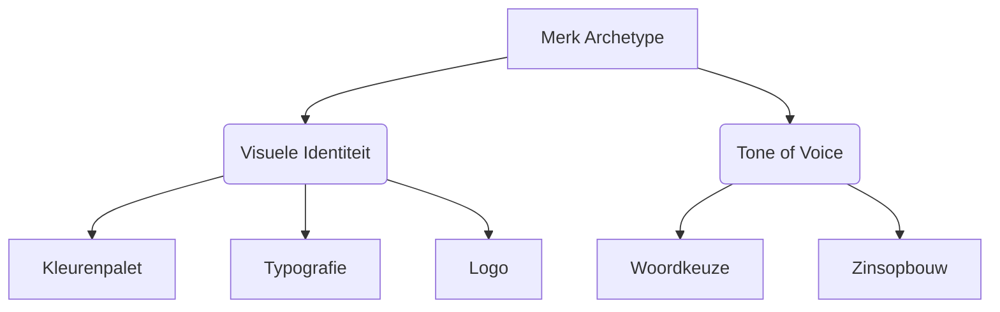
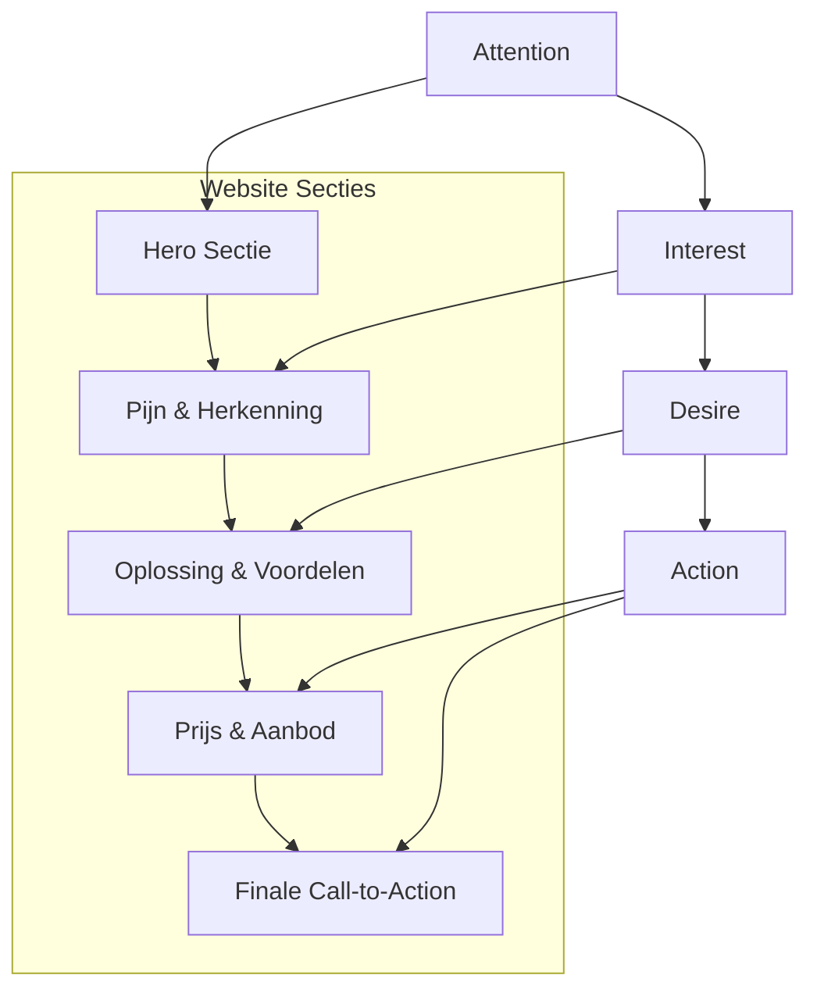
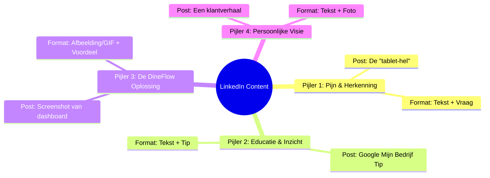
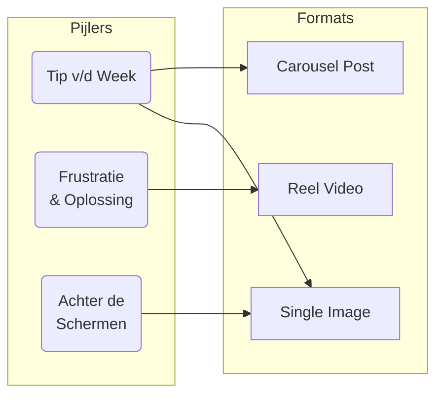
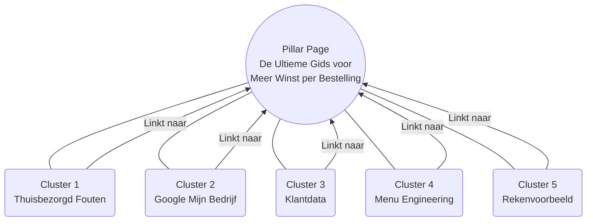
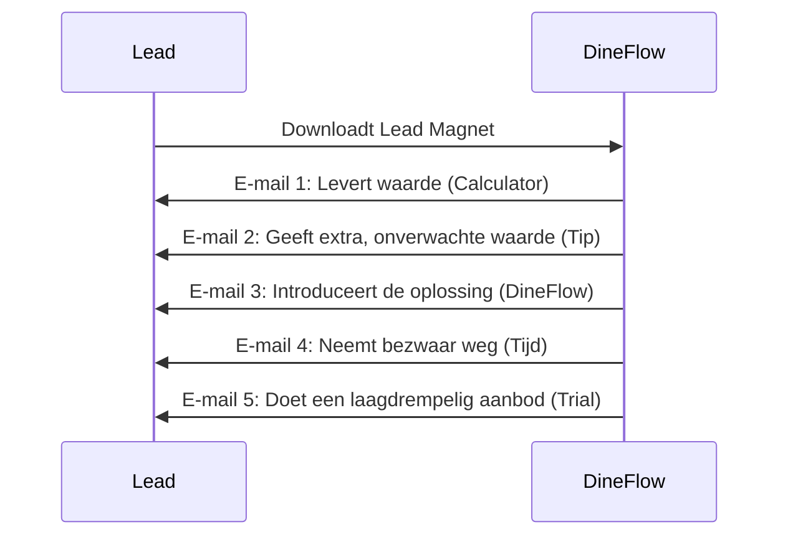
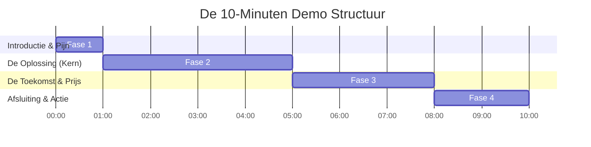
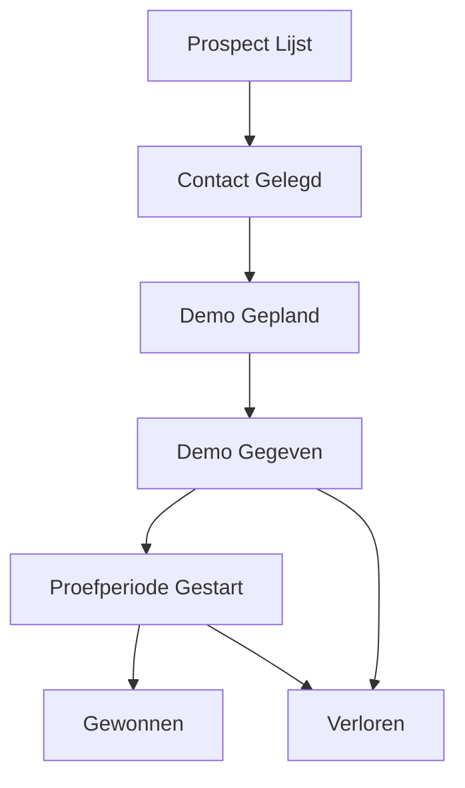

***

# **Project Catalyst: Strategisch Groeiplan**

*   **Onderwerp:** DineFlow
*   **Datum:** 5 augustus 2025
*   **Opdrachtgever:** Thomas, Mede-oprichter
*   **Consultant:** Project Catalyst

---

## **Inleiding & Projectdefinitie**

### **Initiële Vraag**

Dit strategische plan is ontwikkeld naar aanleiding van de volgende vraag van Thomas, mede-oprichter van DineFlow:

> "Ik ben een bedrijf begonnen samen met mijn maatje. Hij heeft het op zich genomen om een soort Sitedish SaaS-platform te bouwen voor Nederlandse restaurants. Het MVP-product is een multi-tenant SAAS-platform waar restaurants een trail kunnen starten voor 14 dagen en vanaf daarna voor ongeveer 25 euro per maand en 30 cent per transactie hun eigen menu, foto's en dergelijke informatie kunnen uploaden. We zijn dit bedrijf gestart omdat we de commissiepercentages van Thuisbezorgd etc. veel te hoog vinden en willen dus echt oprecht de restaurant-eigenaren helpen. Mijn naam is Thomas en ik wil me gaan verdiepen in het stukje marketing en het efficiënt opzetten van een customer service omgeving. Ik heb nog totaal geen ervaring met deze onderwerpen."

### **Strategische Eisen & Doelstellingen**

Op basis van de initiële vraag en de daaropvolgende strategische sessies, is het doel van dit document om een ultra-gedetailleerd, operationeel handboek te creëren. Dit handboek gaat uit van geen enkele voorkennis en is ontworpen om DineFlow te begeleiden bij het opzetten van een krachtige online aanwezigheid die continu potentiële klanten aantrekt. De focus ligt op het bouwen van een geïntegreerd groei-ecosysteem, waarbij alle marketing-, sales- en service-activiteiten samenkomen in het Odoo-platform. Elke stap wordt uitgelegd met een focus op zowel de 'waarom' (de strategie) als de 'hoe' (de executie).

---
## **Module 1: Het Fundament**
### **Prompt 6: De Psychologie van het Merk (Je Ziel)**

**Doel van deze prompt:** Het ontwikkelen van het 'Brand Core Document'. Dit is de absolute basis die de persoonlijkheid, uitstraling en stem van DineFlow definieert. Het is het kompas voor alle toekomstige communicatie, van de tekst op de website tot elke social media post.

#### **1. Educatie: Waarom een Merkpersoonlijkheid Cruciaal is**

Voordat we keuzes maken, moeten we begrijpen waarom. Mensen bouwen relaties op met merken zoals ze dat doen met mensen. Een merk met een duidelijke, consistente persoonlijkheid voelt betrouwbaar en herkenbaar aan. Zeker in een markt vol scepsis, zoals restauranthouders die zich uitgebuit voelen door grote, anonieme tech-platformen, is het opbouwen van een vertrouwensband essentieel.

We gebruiken hiervoor het **Aaker Brand Personality Model**, een framework ontwikkeld aan de Stanford University, dat merkpersoonlijkheid opdeelt in vijf kerndimensies. Bijna elk succesvol merk leunt zwaar op één of twee van deze dimensies.

| Dimensie | Omschrijving | Voorbeelden |
| :--- | :--- | :--- |
| **1. Sincerity (Oprechtheid)** | Nuchter, eerlijk, gezond, vrolijk. | Dove, Innocent Drinks |
| **2. Excitement (Opwinding)** | Gedurfd, levendig, fantasierijk, up-to-date. | Red Bull, Tesla |
| **3. Competence (Competentie)** | Betrouwbaar, intelligent, succesvol. | Google, Microsoft |
| **4. Sophistication (Verfijning)** | Bovenklasse, charmant, luxueus. | Rolex, Mercedes-Benz |
| **5. Ruggedness (Robuustheid)** | Stoer, outdoor, sterk. | Jeep, The North Face |

**Waarom is dit belangrijk voor DineFlow?**
Jouw doelgroep, "De Pragmatische Vechter", is sceptisch tegenover technologie en voelt zich uitgebuit. Om hun vertrouwen te winnen, moet DineFlow niet overkomen als een 'tech-bedrijf' (Excitement) of een 'luxe oplossing' (Sophistication), maar als een betrouwbare, helpende partner. Een duidelijke persoonlijkheid is daarom geen marketingtruc, maar een strategische noodzaak.


*Dit diagram toont hoe het gekozen Merk Archetype de basis vormt voor alle concrete merkuitingen. Zowel de visuele elementen als de manier van schrijven vloeien direct voort uit deze centrale strategische keuze.*

#### **2. Het DineFlow Archetype: De Strategische Keuze**

Op basis van de missie ("oprecht de restaurant-eigenaren helpen") en de doelgroep ("De Pragmatische Vechter"), kiezen we voor een krachtige combinatie van twee archetypes.

*   **Primair Archetype: De Zorgverlener (The Caregiver)**
    *   **Kernverlangen:** Mensen beschermen en voor hen zorgen.
    *   **Waarom het past:** Dit is de essentie van DineFlow.
        *   -> Je wilt restauranthouders beschermen tegen hoge commissies.
        *   -> Je wilt de operationele chaos wegnemen.
        *   -> Je bent de helpende hand, de betrouwbare partner die de last verlicht.

*   **Secundair Archetype: De Gewone Man (The Everyman)**
    *   **Kernverlangen:** Erbij horen, een connectie hebben met anderen.
    *   **Waarom het past:** DineFlow is geen elitair, complex platform.
        *   -> Het is een toegankelijke, no-nonsense tool voor de hardwerkende ondernemer.
        *   -> Je spreekt hun taal en bent 'een van hen', in tegenstelling tot de grote, afstandelijke tech-giganten.

**Conclusie:** DineFlow is **de Zorgverlener in een spijkerbroek**. Competent en helpend, maar ook benaderbaar en zonder pretenties.

#### **3. De Visuele Identiteit: Wat We Laten Zien**

Dit is de non-verbale vertaling van onze gekozen persoonlijkheid.

##### **Kleurenpalet**

De kleuren zijn gekozen om vertrouwen, rust en groei uit te stralen, met een vriendelijke, actiegerichte toets.

| Rol | Kleur | Hex Code | Psychologie & Toepassing |
| :--- | :--- | :--- | :--- |
| **Primair** | Vertrouwen Blauw | `#2C5282` | Straalt competentie, betrouwbaarheid en rust uit. Te gebruiken voor koppen, logo's en belangrijke elementen. |
| **Secundair** | Groei Groen | `#38A169` | Symboliseert groei, succes en positiviteit. Ideaal voor het benadrukken van voordelen, iconen en vinkjes. |
| **Accent** | Actie Geel | `#F6E05E` | Een vriendelijke, energieke kleur die de aandacht trekt. **Exclusief** voor call-to-action knoppen ("Start Proefperiode"). |
| **Neutraal (Tekst)** | Donkergrijs | `#2D3748` | Beter leesbaar en zachter voor de ogen dan puur zwart. Voor alle platte tekst (paragrafen). |
| **Neutraal (Achtergrond)** | Lichtgrijs | `#F7FAFC` | Een subtiele, schone achtergrond die de andere kleuren laat spreken en rust creëert. |

##### **Typografie**

De lettertypes zijn gekozen op basis van leesbaarheid en persoonlijkheid: modern, helder en betrouwbaar. We gebruiken gratis, professionele Google Fonts.

| Rol | Lettertype | Gevoel / Persoonlijkheid | Toepassing |
| :--- | :--- | :--- | :--- |
| **Koppen** | **Montserrat** | Sterk, competent, modern, maar toch vriendelijk door de ronde vormen. | Alle H1, H2, H3 koppen op de website en in marketingmateriaal. |
| **Platte Tekst** | **Lato** | Warm, stabiel, extreem goed leesbaar. Straalt oprechtheid en betrouwbaarheid uit. | Alle paragrafen, menu-items, en langere stukken tekst. |

##### **Logo Creatie (Stap-voor-stap in Canva)**

1.  **Start:** Ga naar `www.canva.com` en maak een gratis account. Zoek naar de "Logo" template (500x500 pixels).
2.  **Tekst Toevoegen:**
    *   -> Klik links op **"Tekst"** -> **"Een koptekst toevoegen"**.
    *   -> Typ de naam: `DineFlow`.
3.  **Lettertype Instellen:**
    *   -> Selecteer de tekst.
    *   -> Wijzig in de linkerbovenhoek het lettertype naar **"Montserrat"** (kies een vetgedrukte variant zoals 'Bold' of 'SemiBold').
4.  **Kleur Instellen:**
    *   -> Selecteer de tekst.
    *   -> Klik op het icoon voor tekstkleur ('A').
    *   -> Klik op `+ Een nieuwe kleur toevoegen` en vul de hex-code in: `#2C5282`.
5.  **Tagline Toevoegen (Optioneel):**
    *   -> Klik op **"Tekst"** -> **"Een subkoptekst toevoegen"**.
    *   -> Typ `Meer winst. Minder chaos.`
    *   -> Maak deze tekst kleiner en gebruik het lettertype **"Lato"** in de kleur **Donkergrijs (`#2D3748`)**.
6.  **Downloaden:**
    *   -> Klik rechtsboven op **`Delen`** -> **`Downloaden`**.
    *   -> Kies als bestandstype `PNG` en vink **"Transparante achtergrond"** aan. Dit is cruciaal.
    *   -> Klik op `Downloaden`. Je hebt nu een professioneel logo.

#### **4. De Tone of Voice: Hoe We Klinken**

Dit is de persoonlijkheid vertaald naar woorden. Onze stem is in drie woorden: **Behulpzaam, Duidelijk, Oprecht.**

| | Do's (Wel doen) | Don'ts (Niet doen) |
| :--- | :--- | :--- |
| **Behulpzaam** | Gebruik "je" en "jij". Focus op de voordelen voor de restauranthouder. Anticipeer op vragen. | Spreken vanuit "wij" en onze features. Aannemen dat de lezer alles al weet. |
| **Duidelijk** | Gebruik simpele, korte zinnen. Gebruik metaforen uit de keuken ("jouw digitale voordeur"). | Corporate jargon gebruiken ("synergie", "optimaliseren"). Complexe, lange zinnen. |
| **Oprecht** | Erken de problemen en frustraties. Wees transparant over prijzen. Toon de mens achter het bedrijf. | Overdrijven of valse beloftes doen. Onpersoonlijk en afstandelijk zijn. |

##### **Voorbeelden in de praktijk:**

> **Fout (Afstandelijk & Technisch):**
> "Ons SaaS-platform faciliteert de optimalisatie van uw bestel-workflow door middel van een geïntegreerde multi-tenant architectuur."

> **Correct (Behulpzaam & Duidelijk):**
> "DineFlow is ontworpen om je leven makkelijker te maken. Alle bestellingen komen binnen op één overzichtelijke plek, zodat jij je kunt focussen op wat echt telt."

> **Correct (Oprecht & Empathisch):**
> "We weten hoe frustrerend het is om een groot deel van je hardverdiende omzet te zien verdwijnen. Daarom hebben we DineFlow gebouwd: een eerlijk alternatief, voor een eerlijke prijs."

---
### **Checklist voor Voltooiing (Prompt 6)**

*   [ ] Het primaire en secundaire merk archetype zijn gekozen en begrepen.
*   [ ] Het kleurenpalet met de 5 gedefinieerde rollen en hex-codes is vastgesteld.
*   [ ] De lettertypes (Montserrat voor koppen, Lato voor tekst) zijn gekozen.
*   [ ] Een eerste versie van het logo is gemaakt volgens de handleiding.
*   [ ] De Tone of Voice (Behulpzaam, Duidelijk, Oprecht) is akkoord en de voorbeelden zijn helder.
*   [ ] Dit 'Brand Core Document' is opgeslagen als het centrale fundament voor alle toekomstige uitingen.


***

## **Module 2: De Digitale Aanwezigheid**
### **Prompt 7: De Conversiegerichte Website (Je Digitale Winkelpui)**

**Doel van deze prompt:** Het creëren van de definitieve, strategische blauwdruk voor de `dineflow.nl` website. Dit document beschrijft de structuur, de tekst en de SEO-fundamenten die nodig zijn om van een anonieme bezoeker een geïnteresseerde lead te maken.

#### **1. Educatie: De Psychologie van een Winnende Website (Het AIDA-model)**

Een effectieve website is geen digitale brochure; het is een zorgvuldig ontworpen psychologische reis. We gebruiken het klassieke AIDA-marketingmodel om deze reis te structureren. Het doel is om "De Pragmatische Vechter" stap voor stap te begeleiden van scepsis naar actie.


*Dit diagram toont hoe de secties van de homepage de bezoeker door de AIDA-funnel leiden. Elke sectie heeft een specifiek psychologisch doel, van het grijpen van de aandacht tot het aanzetten tot actie.*

#### **2. Executie: De Anatomie van de DineFlow Homepage**

Hieronder volgt de sectie-voor-sectie opbouw van de perfecte homepage.

---

##### **Sectie 1: De Navigatie & Hero (Aandacht)**
*   **Doel:** De aandacht van de bezoeker grijpen binnen 3 seconden en direct de kernbelofte communiceren.

*   **Concepttekst:**
    *   **H1 - De Hoofdkop:**
        > **Meer Winst, Minder Chaos. Het Eerlijke Bestelsysteem voor Jouw Restaurant.**
    *   **Subkop:**
        > Stop met het weggeven van je marge aan dure platformen. Met DineFlow krijg je een eigen, commissievrije bestelwebsite voor een vast, laag bedrag per maand. Eenvoudig, eerlijk en volledig van jou.
    *   **Primaire Knop (Call to Action):**
        > `Start Mijn Gratis Proefperiode`
    *   **Secundaire Link (Voor de twijfelaars):**
        > `Bekijk de Demo (2 min)`

*   **Design & Visuele Instructies:**
    *   -> **Achtergrond:** Een heldere, professionele foto of een korte video-loop van een schone, moderne keuken of een vriendelijke restauranthouder die op een tablet werkt.
    *   -> **Typografie:** De H1-kop in **Montserrat** (vet), subkop in **Lato**.
    *   -> **Kleuren:** De primaire knop moet de **Actie Geel (`#F6E05E`)** kleur hebben. De tekst is **Donkergrijs (`#2D3748`)**.

---

##### **Sectie 2: De Pijn & Herkenning (Interesse)**
*   **Doel:** De interesse wekken door te laten zien dat we de dagelijkse frustraties van de restauranthouder 100% begrijpen.

*   **Concepttekst:**
    *   **Kop:**
        > **Herken je dit?**
    *   **Drie kolommen met icoon en tekst:**
        *   **Kolom 1 (Pijn: Commissie):**
            > **Winst die verdampt.** Je werkt hard voor elke bestelling, maar ziet tot 30% van je omzet verdwijnen naar een anoniem platform.
        *   **Kolom 2 (Pijn: Chaos):**
            > **De "tablet-hel".** Rinkelende tablets, losse bonnetjes en de constante stress om een bestelling te missen tijdens de spits.
        *   **Kolom 3 (Pijn: Afhankelijkheid):**
            > **Jouw klanten, hun data.** Je bouwt geen directe relatie op en bent volledig afhankelijk van hun regels en algoritmes.

*   **Design & Visuele Instructies:**
    *   -> Gebruik simpele, duidelijke iconen die elke pijn representeren.
    *   -> Houd de achtergrond rustig (**Lichtgrijs (`#F7FAFC`)**) om de tekst te laten spreken.

---

##### **Sectie 3: De Oplossing & Voordelen (Verlangen)**
*   **Doel:** Het verlangen naar een betere toekomst opwekken door de oplossing te presenteren.

*   **Concepttekst:**
    *   **Kop:**
        > **Er is een betere manier. Dit is hoe DineFlow je helpt.**
    *   **Drie kolommen, spiegelend aan de pijn-sectie:**
        *   **Kolom 1 (Oplossing: Commissie):**
            > **Houd wat je verdient.** Met ons vaste, lage maandbedrag en een minimale transactiefee, houd jij de winst in je eigen zak.
        *   **Kolom 2 (Oplossing: Chaos):**
            > **Eén systeem, totale rust.** Alle online bestellingen komen binnen op één overzichtelijke plek. Meer controle, minder fouten.
        *   **Kolom 3 (Oplossing: Afhankelijkheid):**
            > **Bouw je eigen merk.** Krijg je eigen bestelwebsite en alle klantdata. Maak van eenmalige bestellers trouwe fans.

*   **Design & Visuele Instructies:**
    *   -> Gebruik hier screenshots van het overzichtelijke DineFlow-dashboard.
    *   -> Gebruik de **Groei Groen (`#38A169`)** kleur voor de iconen of vinkjes om de positieve voordelen te benadrukken.

---

##### **Sectie 4: Prijsstelling (Actie)**
*   **Doel:** Elke twijfel over de kosten wegnemen met een extreem helder en eerlijk aanbod.

*   **Concepttekst:**
    *   **Kop:**
        > **Geen verrassingen. Gewoon één eerlijke prijs.**
    *   **In een uitgelicht kader:**
        > **€25**
        > *per maand*
        >
        > **+ €0.30**
        > *per transactie*
        >
        > **Inclusief:**
        > ✔ Onbeperkt aantal bestellingen
        > ✔ Je eigen `[naam].dineflow.nl` website
        > ✔ Online betalingen via iDEAL, etc.
        > ✔ Persoonlijke ondersteuning
        >
        > **Probeer de eerste 14 dagen volledig gratis.**
    *   **Knop:**
        > `Start Vandaag Nog - Zonder Risico`

*   **Design & Visuele Instructies:**
    *   -> Plaats het prijsplan in een duidelijk afgebakend kader.
    *   -> De knop is weer de **Actie Geel (`#F6E05E`)**.

#### **3. SEO Masterclass voor Beginners (Je Digitale Vindbaarheid)**

Een prachtige website die niemand kan vinden, is nutteloos. SEO (Search Engine Optimization) is de kunst om Google te helpen begrijpen waar jouw pagina over gaat.

*   **Stap 1: Het Juiste Zoekwoord Kiezen**
    *   -> **Educatie:** "User Intent" is de *bedoeling* achter een zoekopdracht. We richten ons op de intentie van restauranthouders die een **commercieel probleem** willen oplossen.
    *   -> **Executie:**
        *   **Primair Zoekwoord:** We kiezen één hoofdonderwerp voor de homepage: **"bestelsysteem restaurant commissievrij"**. Dit bevat het product, de doelgroep en het belangrijkste voordeel.
        *   **Secundaire Zoekwoorden:** "eigen bestelsite restaurant", "thuisbezorgd alternatief", "commissievrij afhalen". Verwerk deze natuurlijk in de teksten.

*   **Stap 2: De Perfecte Meta Title (Je Etalage in Google)**
    *   -> **Educatie:** De titel in de Google zoekresultaten. Deze moet de aandacht trekken.
    *   -> **Executie:**
        *   **Formule:** `Primair Zoekwoord | Belangrijkste Voordeel | Merknaam`
        *   **Voorbeeld:** `Bestelsysteem Restaurant Commissievrij | Meer Winst & Controle | DineFlow`

*   **Stap 3: De Overtuigende Meta Description (De Uitnodiging)**
    *   -> **Educatie:** De korte tekst onder de titel in Google. Deze moet de klik aanmoedigen.
    *   -> **Executie:**
        *   **Formule:** `[Herkenning probleem]. [Introductie oplossing & voordeel]. [Call-to-Action].`
        *   **Voorbeeld:** `Moe van de hoge commissies en chaos van bezorgplatformen? DineFlow biedt een eerlijk, commissievrij bestelsysteem voor jouw restaurant. Start vandaag je gratis proefperiode!`

*   **Stap 4: De Structuur (Koppen)**
    *   -> **Educatie:** Google leest je pagina zoals jij een boek leest, met koppen en subkoppen.
    *   -> **Executie:**
        *   **`<h1>`:** Er mag maar **één H1** per pagina zijn (je hoofdkop).
        *   **`<h2>`:** Gebruik H2's voor de koppen van je hoofdsecties.
        *   **`<h3>`:** Gebruik H3's voor subkoppen binnen die secties.

*   **Stap 5: Afbeeldingen (Alt Text)**
    *   -> **Educatie:** Een "alternatieve tekst" beschrijft wat er op een afbeelding staat. Dit is voor blinde/slechtziende bezoekers én voor Google.
    *   -> **Executie:**
        *   **Hoe:** Geef elke afbeelding een korte, beschrijvende alt-tekst.
        *   **Voorbeeld:** `alt="Overzichtelijk dashboard van het DineFlow bestelsysteem"`

---
### **Checklist voor Voltooiing (Prompt 7)**

*   [ ] De AIDA-structuur is begrepen en toegepast op de pagina-indeling.
*   [ ] De conceptteksten voor alle 4 de hoofdsecties zijn geschreven en volgen de Tone of Voice.
*   [ ] De visuele instructies (kleuren, lettertypes) zijn genoteerd voor de implementatie.
*   [ ] Het primaire zoekwoord is gekozen.
*   [ ] De `meta title` en `meta description` zijn opgesteld volgens de formules.
*   [ ] De H1/H2/H3-structuur is duidelijk.
*   [ ] Het belang van `alt text` voor afbeeldingen is genoteerd.

---
### **Prompt 8: De LinkedIn Autoriteit (Van Profiel tot Prospect)**

**Doel van deze prompt:** Het creëren van de complete LinkedIn-strategie om DineFlow en Thomas te positioneren als de nummer één autoriteit voor de moderne Nederlandse restauranthouder.

#### **1. Educatie: De Psychologie van LinkedIn voor B2B**

De grootste fout is LinkedIn zien als een online CV. Het is een **professioneel netwerkdiner**. Je komt niet binnen en roept: "KOOP MIJN PRODUCT!". Je knoopt gesprekken aan, luistert, deelt waardevolle inzichten, en pas als er een vertrouwensband is, praat je over zaken. Ons doel is om jouw aanwezigheid te transformeren van een passief CV naar een **actief autoriteitsprofiel** dat je doelgroep aantrekt.

#### **2. Executie (Stap 1): De DineFlow Bedrijfspagina**

Dit is je officiële hoofdkantoor op LinkedIn. Het moet professionaliteit en de kernmissie uitstralen.

*   **Aanmaken:**
    *   -> Klik rechtsboven op **'Werk'** -> **'Bedrijfspagina maken'** -> **'Bedrijf'**.
*   **Basisgegevens:**
    *   -> **Naam:** `DineFlow`
    *   -> **Openbare URL:** `linkedin.com/company/dineflow-nl`
    *   -> **Slogan:** `Het Eerlijke Bestelsysteem voor Jouw Restaurant.`
*   **Logo & Banner:**
    *   -> Upload het logo uit Prompt 6.
    *   -> Ontwerp een banner (1584x396 px) in Canva met je logo, de H1-kop (`Meer Winst, Minder Chaos.`), en de **Vertrouwen Blauwe** achtergrond.
*   **"Over Ons" Tekst:** Gebruik de AIDA-structuur.
    > **(Attention)** Bent u een restauranthouder en moe van de torenhoge commissies en operationele chaos?
    > **(Interest)** Wij zijn DineFlow. En wij zijn opgericht omdat de winst van een bestelling hoort bij de persoon die het hardste werkt: u.
    > **(Desire)** Daarom hebben we een eerlijk, eenvoudig en commissievrij bestelsysteem gebouwd dat u volledige controle geeft.
    > **(Action)** Volg onze pagina voor praktische tips, of bezoek onze website om uw gratis proefperiode te starten.

#### **3. Executie (Stap 2): Jouw Persoonlijke Profiel, Thomas**

Mensen doen zaken met mensen. Jouw profiel is je belangrijkste tool.

*   **Profielfoto:** Een professionele, vriendelijke headshot. Glimlach!
*   **Banner:** Ontwerp in Canva. Maak het persoonlijk: een rustige achtergrond in **Vertrouwen Blauw** met de tekst: `Ik help restauranthouders de controle terug te krijgen.`
*   **Kopregel (Headline):** Dit is het allerbelangrijkste.
    *   -> **Formule:** `[Jouw Rol] | Ik help [Doelgroep] met [Hun Doel] door [Hun Pijn op te lossen]`
    *   -> **Jouw Perfecte Kopregel:** `Mede-oprichter van DineFlow | Ik help restauranthouders meer winst te maken door ze te bevrijden van hoge commissies en operationele chaos.`
*   **"Info" Sectie (Jouw Verhaal):** Schrijf dit in de eerste persoon ("ik").
    > Ik ben Thomas, en samen met mijn compagnon ben ik DineFlow gestart vanuit een diepe frustratie. Ik zag hoe vrienden in de horeca hun ziel in hun zaak stopten, om een groot deel van hun marge te zien verdwijnen naar anonieme platformen. Ik vond dat het anders moest. DineFlow is ons antwoord. Het is een missie om de controle en de winst terug te geven aan de restauranthouder. Bent u een restauranthouder en wilt u sparren? Stuur me gerust een bericht. Ik help u graag.

#### **4. Executie (Stap 3): De Contentstrategie**

Post niet zomaar wat. Werk met een contentmatrix voor variatie en consistentie.


*Dit mindmap-diagram visualiseert de vier contentpijlers voor LinkedIn. Elke pijler heeft een ander doel en format, wat zorgt voor een gevarieerde en interessante feed die zowel empathie toont als expertise uitstraalt.*

| Pijler | Doel | Voorbeeld Post |
| :--- | :--- | :--- |
| **1. Pijn & Herkenning** | Empathie tonen, laten zien dat je het écht snapt. | **Tekst:** "Maandagavond, 20:05. Drie tablets rinkelen tegelijk. Voor veel restauranthouders is dit de realiteit van de 'tablet-hel'. Wie herkent dit? 👇 #horeca" |
| **2. Educatie & Inzicht** | Waarde geven zonder te verkopen. Positioneert jou als expert. | **Tekst:** "💡 Tip: Zorg dat de 'Bestel' knop op je Google Profiel naar je EIGEN site linkt, niet naar Thuisbezorgd. Zo bespaar je direct 14% commissie. #horecatips" |
| **3. De DineFlow Oplossing** | Het product tonen, maar altijd als de oplossing voor een probleem. | **Tekst:** "Stel je voor: alle online bestellingen op één rustig scherm. Dat is geen droom, dat is wat ons platform doet. Gebouwd voor rust in de zaak. #dineflow" (met een GIF) |
| **4. Persoonlijke Visie** | De mens achter het merk tonen. Bouwt de diepste connectie. | **Tekst:** "Vandaag sprak ik een restauranthouder die €1.200 per maand kwijt was aan commissies. Dit is precies WAAROM we DineFlow bouwen. #missie" |

---
### **Checklist voor Voltooiing (Prompt 8)**

*   [ ] De psychologie van LinkedIn als 'netwerkdiner' is begrepen.
*   [ ] De bedrijfspagina is aangemaakt met logo, banner en "Over Ons"-tekst.
*   [ ] Het persoonlijke profiel van Thomas is geoptimaliseerd (foto, banner, kopregel, info-tekst).
*   [ ] De vier contentpijlers zijn duidelijk en de voorbeelden zijn begrepen.
*   [ ] Er is een plan om wekelijks vanuit deze pijlers te gaan posten.


***

***

### **Prompt 9: De Instagram Connectie (Visueel & Lokaal Winnen)**

**Doel van deze prompt:** Het creëren van de complete Instagram-strategie. Het doel is niet directe verkoop, maar het bouwen van een sympathiek merk en een visueel aantrekkelijke connectie met de (lokale) horecagemeenschap.

#### **1. Educatie: De Psychologie van Instagram voor B2B**

De grootste misvatting is dat Instagram alleen voor B2C (Business-to-Consumer) is. Dat is onjuist. De beslissers binnen B2B (restauranthouders) zijn ook gewoon mensen die op Instagram zitten voor ontspanning, inspiratie en connectie.

Het doel van DineFlow op Instagram is **niet** om software te verkopen. Het doel is:
1.  **Merk bouwen:** Een visueel aantrekkelijke en herkenbare aanwezigheid creëren die de 'Zorgverlener in een spijkerbroek' persoonlijkheid uitstraalt.
2.  **Sympathie winnen:** De menselijke, zorgzame kant van DineFlow laten zien. Het gaat om het tonen van empathie voor de dagelijkse strijd van de horecaondernemer.
3.  **Community vormen:** Een plek creëren waar restauranthouders zich gezien en begrepen voelen, en waar ze tips kunnen uitwisselen.

Als een restauranthouder DineFlow's naam later ergens anders tegenkomt (bv. op LinkedIn of via een e-mail), zal de positieve, visuele herinnering van Instagram de kans op een conversie aanzienlijk verhogen. Het is het zaaien van sympathie.

#### **2. Executie (Stap 1): Het Account Aanmaken (Vanaf Nul)**

Dit is de handleiding voor het opzetten van het account, uitgaande van absolute nul.

*   **Voorbereiding:**
    *   -> Zorg dat je een zakelijk e-mailadres hebt (bv. `info@dineflow.nl`).
    *   -> Zorg dat je het logo-bestand (PNG met transparante achtergrond uit Prompt 6) op je telefoon hebt staan.

*   **Stapsgewijze Handleiding:**
    1.  **Download de App:** Download de Instagram-app uit de App Store (iOS) of Google Play Store (Android).
    2.  **Account Creëren:** Open de app en kies **"Registreren met e-mailadres of telefoonnummer"**. Gebruik je zakelijke e-mailadres.
    3.  **Naam en Wachtwoord:**
        *   -> **Volledige naam:** `DineFlow`
        *   -> **Wachtwoord:** Kies een sterk, uniek wachtwoord.
    4.  **Gebruikersnaam Kiezen:**
        *   -> Instagram zal een gebruikersnaam voorstellen. Wijzig deze naar `@dineflow.nl`. Dit is professioneel en consistent met je website. Als deze bezet is, probeer dan `@dineflow_nl`.
    5.  **Profiel Voltooien (Eerste Opzet):**
        *   -> Sla het verbinden met Facebook-contacten voor nu over.
        *   -> Voeg je logo toe als profielfoto.

*   **Overschakelen naar een Bedrijfsaccount:** Dit is de meest cruciale stap.
    1.  -> Ga naar je profiel (icoon rechtsonder).
    2.  -> Tik op het menu-icoon (drie streepjes) rechtsboven.
    3.  -> Ga naar **`Instellingen en privacy`**.
    4.  -> Scroll naar beneden en tik op **`Accounttype en -tools`**.
    5.  -> Tik op **`Overschakelen naar professioneel account`**.
    6.  -> Volg de stappen. Kies als categorie **`Softwarebedrijf`** of **`Ondernemer`**.
    7.  -> Kies als accounttype **`Bedrijf`** (niet 'Creator'). Dit geeft je de juiste tools.
    8.  -> Vul je zakelijke contactgegevens in (e-mailadres).

#### **3. Executie (Stap 2): Het Perfecte Profiel Optimaliseren**

Nu het account staat, gaan we het perfectioneren.

*   **Bio Schrijven:**
    *   -> De bio is cruciaal en beperkt. Gebruik elke regel strategisch.
    > Wij helpen horecaondernemers.
    > Meer winst & minder chaos met ons eerlijke bestelsysteem.
    > Gebouwd door en voor de horeca.
    > 👇 Tips, tools & inspiratie voor jouw zaak:
    > [Jouw Linktree-link]

*   **Link-in-Bio (met Linktree):**
    *   -> Maak een gratis account aan op `Linktr.ee`.
    *   -> **Waarom?** Instagram staat maar één link toe. Linktree maakt van die ene link een mini-landingspagina, waardoor je de waarde van die ene klik maximaliseert.
    *   -> Stel de volgende links in op je Linktree, in deze volgorde van prioriteit:
        1.  `💻 Start je Gratis Proefperiode` (linkt naar de DineFlow website)
        2.  `✍️ Lees onze nieuwste Blog` (linkt naar de blog)
        3.  `📄 Download de Commissie-Calculator` (linkt naar de lead magnet)
        4.  `🤝 Connect op LinkedIn` (linkt naar jouw persoonlijke LinkedIn-profiel)

*   **Story Hoogtepunten (Highlights):**
    *   -> Dit zijn de opgeslagen stories die permanent op je profiel staan. Ze fungeren als een visueel menu. Maak de volgende drie aan:
        1.  **"Over Ons"**: Een paar slides die de missie van DineFlow vertellen.
        2.  **"Hoe het werkt"**: Een simpele uitleg van de DineFlow-dienst.
        3.  **"Tips"**: Een verzameling van je beste tips voor restauranthouders.
    *   -> **Cover-icoontjes:** Ontwerp in Canva simpele, bijpassende icoontjes voor elke highlight in je merkkleuren.

#### **4. Executie (Stap 3): De Contentstrategie**

Consistentie en herkenbaarheid zijn alles. Ontwerp voor elke pijler een vast template in Canva.


*Dit diagram laat zien hoe de drie contentpijlers voor Instagram kunnen worden vertaald naar verschillende post-formats. Dit zorgt voor een gevarieerde, maar toch herkenbare, contentkalender.*

| Pijler | Doel | Format & Template | Voorbeeld Post |
| :--- | :--- | :--- | :--- |
| **1. De Tip van de Week** | Waarde geven, educatie, vertrouwen opbouwen. | **Carousel (meerdere slides).** Template: Eerste slide met een pakkende titel in **Montserrat** op een **Vertrouwen Blauwe** achtergrond. | **Titel:** "3 Manieren om je Google Profiel voor je te laten werken." **Slides:** 1. Titel, 2. Tip 1 (met icoon), 3. Tip 2 (met icoon), 4. Tip 3 (met icoon), 5. Call-to-Action: "Meer tips? Link in bio!". |
| **2. Frustratie & Oplossing** | Empathie tonen, herkenning creëren, de waarde van DineFlow subtiel tonen. | **Reel (korte video).** Simpel en authentiek. Geen dure productie. | **Video-idee:** Een korte, snelle montage van een rinkelende telefoon, een overvol bonnetjesrek, een gefrustreerde blik. Dan een rustig beeld van het DineFlow-dashboard met een vinkje eroverheen. **Tekst:** "Van chaos naar controle. Wij snappen het. #horecaleven" |
| **3. Achter de Schermen & Missie** | De mens achter het merk laten zien, sympathie winnen. | **Single Image Post.** Een authentieke foto, geen stock-foto. | **Foto-idee:** Thomas die een kop koffie drinkt achter zijn laptop, met een notitieblok vol ideeën. **Tekst:** "Vroege ochtend, grote plannen. Vandaag werken we aan een nieuwe feature die het voor onze klanten nóg makkelijker gaat maken. Wat is de grootste uitdaging in JOUW dagelijkse operatie? #ondernemen #startup #dineflow" |

#### **5. Executie (Stap 4): De Hashtag & Engagement Masterclass**

Hashtags zijn geen versiering; het is het zoeksysteem van Instagram. Een goede strategie maakt je zichtbaar voor de juiste mensen.

*   **De Gelaagde Hashtag Strategie:** Gebruik een mix van 20-30 hashtags per post, verdeeld over 3 lagen.
    *   -> **Brede Hashtags (Groot bereik, veel concurrentie):** `#horeca` `#ondernemen` `#restaurant` `#foodservice` `#hospitality`
    *   -> **Niche Hashtags (Specifieker, relevanter publiek):** `#horecanederland` `#horecaondernemer` `#restaurantlife` `#chefslife` `#keuken` `#bezorgen` `#afhalen`
    *   -> **Community & Lokale Hashtags (Klein, maar zeer betrokken):** `#dineflow` `#commissievrij` `#eerlijkehoreca` `#horecatips` `#restauranteigenaar` `#[jouwstad]horeca` (bv. `#rotterdamhoreca`)
    *   -> **Pro Tip:** Sla deze sets op in je notities en kopieer/plak ze in de **eerste reactie** onder je post, niet in de post-tekst zelf. Dit houdt je post schoon.

*   **De Dagelijkse Engagement Checklist (15 min/dag):**
    *   -> **[5 min] Reageren:** Beantwoord elke reactie op je eigen posts met een oprechte reactie (geen 'dankje' maar een wedervraag).
    *   -> **[5 min] Ontdekken:** Ga naar een relevante hashtag (bv. `#horecaondernemer`), like de top 9 posts en laat bij 3 ervan een waardevolle, inhoudelijke reactie achter.
    *   -> **[5 min] Verbinden:** Volg 5-10 nieuwe accounts van restaurants of horeca-ondernemers die passen bij je doelgroep.

---
### **Checklist voor Voltooiing (Prompt 9)**

*   [ ] De rol van Instagram voor DineFlow (merk bouwen, niet direct verkopen) is begrepen.
*   [ ] Het Instagram-account is aangemaakt met een zakelijk e-mailadres.
*   [ ] Het profiel is omgezet naar een 'Bedrijfsaccount'.
*   [ ] De bio is geschreven en de Linktree is ingesteld met de 4 kernlinks.
*   [ ] De Story Hoogtepunten zijn aangemaakt met bijpassende covers.
*   [ ] De 3 visuele contentpijlers zijn duidelijk en er zijn Canva-templates voor gemaakt.
*   [ ] De gelaagde hashtag-strategie is begrepen en de hashtag-set is opgeslagen.
*   [ ] Het dagelijkse engagement-plan van 15 minuten is genoteerd.


***

### **Prompt 10: De Content Motor (Je Blog als Kenniscentrum)**

**Doel van deze prompt:** Het ontwikkelen van de contentstrategie voor de DineFlow blog. Het doel is om de blog te transformeren van een 'leuk extraatje' naar een strategische machine die (1) hoog rankt in Google op relevante zoektermen, (2) het vertrouwen van restauranthouders wint door hun problemen op te lossen, en (3) hen naar onze lead magnet en proefperiode leidt.

#### **1. Educatie: De Psychologie van Content Marketing (Het "Pillar & Cluster" Model)**

Vroeger probeerden bedrijven te ranken op honderden losse zoekwoorden. Google is slimmer geworden. Het beloont nu websites die diepgaande **thematische expertise** tonen over een specifiek onderwerp. De meest effectieve manier om dit te doen is via het "Pillar & Cluster" model.

*   **Pillar Page (De Pijler):** Een zeer lange, diepgaande gids (3000+ woorden) die een breed, belangrijk onderwerp volledig behandelt. Het is het centrale kenniscentrum.
*   **Cluster Content (De Clusters):** Kortere, specifieke blogposts (800-1500 woorden) die dieper ingaan op één sub-onderwerp van de Pillar Page.
*   **Interne Links:** Elke Cluster-post linkt omhoog naar de Pillar Page. De Pillar Page linkt omlaag naar elke relevante Cluster-post.

**Waarom dit werkt:** Dit spinnenweb van interne links signaleert aan Google: "Hey, DineFlow is niet zomaar een bedrijf, het is een **expert** op het gebied van restaurant-efficiëntie en winstgevendheid." Dit leidt tot hogere rankings voor zowel de pillar als de clusters. Het is de hoeksteen van moderne SEO.


*Dit diagram toont het "Pillar & Cluster" model. De centrale "Pillar Page" is een diepgaande gids over een breed onderwerp. De "Cluster" blogposts behandelen specifieke sub-onderwerpen en linken allemaal terug naar de Pillar Page. Dit creëert een 'spinnenweb' van interne links, wat voor Google een krachtig signaal is van thematische autoriteit.*

#### **2. Executie (Stap 1): De Eerste Pillar Page**

We beginnen met het definiëren van onze eerste, belangrijkste Pillar Page. Dit wordt het meest waardevolle stuk content op onze hele website.

*   **Titel van de Pillar Page:**
    > **De Ultieme Gids voor Meer Winst per Bestelling: Een Handboek voor de Moderne Restauranthouder**

*   **Outline van de Pillar Page (Hoofdstukken):**
    1.  **Introductie:** De harde realiteit van de marges in de horeca. Waarom elke euro telt.
    2.  **Hoofdstuk 1: De Verborgen Kosten van Bezorgplatformen.**
        *   -> Een diepe duik in commissies (listing vs. bezorging).
        *   -> De impact van servicekosten voor de klant.
        *   -> De druk om mee te doen aan promoties.
        *   -> De conclusie: wat kost het je écht per jaar?
    3.  **Hoofdstuk 2: Optimaliseer je Digitale Etalage.**
        *   -> De onmisbare rol van Google Mijn Bedrijf.
        *   -> Hoe je social media profielen kunt inzetten als verkeersbron.
        *   -> De elementen van een converterende eigen website.
    4.  **Hoofdstuk 3: De Psychologie van het Online Menu.**
        *   -> Introductie tot Menu Engineering.
        *   -> De kracht van foto's en beschrijvingen.
        *   -> Strategieën voor upselling en cross-selling (drankjes, bijgerechten).
    5.  **Hoofdstuk 4: Klantdata: Het Goud in je Kassa.**
        *   -> Het verschil tussen een anonieme bestelling en een klantrelatie.
        *   -> Het belang van het bezitten van klantgegevens voor loyaliteit.
        *   -> Simpele manieren om herhaalbestellingen te stimuleren.
    6.  **Hoofdstuk 5: De Kracht van een Eigen, Commissievrij Systeem.**
        *   -> De voordelen op een rij: financieel, operationeel, marketing.
        *   -> Hoe je klanten stimuleert om direct bij jou te bestellen.
    7.  **Conclusie:** Jouw stappenplan naar een winstgevender online operatie, met een duidelijke call-to-action naar de DineFlow proefperiode.

#### **3. Executie (Stap 2): Het Eerste "Topic Cluster"**

Nu definiëren we 5 specifieke blogposts die dieper ingaan op de sub-onderwerpen van onze Pillar Page.

*   **Blogpost Idee 1: Thuisbezorgd Fouten**
    *   -> **Titel:** 5 Fouten in je Thuisbezorgd-profiel die je Marge Kosten (en Hoe je ze Vandaag Oplost)
    *   -> **Linkt naar:** Hoofdstuk 1 & 2 van de Pillar Page.
    *   -> **Outline:** Intro (waarom je profiel meer is dan een menukaart), Fout 1 (slechte foto's), Fout 2 (geen gebruik maken van promoties), Fout 3 (onduidelijke menustructuur), Fout 4 (niet reageren op reviews), Fout 5 (geen link naar eigen site), Conclusie.
    *   -> **Primaire Zoekwoorden:** "thuisbezorgd profiel optimaliseren", "meer bestellingen thuisbezorgd".

*   **Blogpost Idee 2: Google Mijn Bedrijf**
    *   -> **Titel:** Hoe je Google Mijn Bedrijf Omtovert tot je Beste Verkoopkanaal (en het is 100% Gratis)
    *   -> **Linkt naar:** Hoofdstuk 2 van de Pillar Page.
    *   -> **Outline:** Intro (waarom GMB belangrijker is dan welk platform dan ook), Stap 1 (claimen), Stap 2 (perfecte info), Stap 3 (de 'Bestel' knop naar je EIGEN site), Stap 4 (gebruik Google Posts), Stap 5 (verzamel reviews), Conclusie.
    *   -> **Primaire Zoekwoorden:** "google mijn bedrijf restaurant", "online bestellen google".

*   **Blogpost Idee 3: Klantdata**
    *   -> **Titel:** Waarom 'Klantdata' het Meest Waardevolle Ingrediënt van je Restaurant is
    *   -> **Linkt naar:** Hoofdstuk 4 van de Pillar Page.
    *   -> **Outline:** Intro (wat is klantdata?), Argument 1 (kracht van herhaalbestellingen), Argument 2 (persoonlijke marketing), Argument 3 (feedback voor menu), Argument 4 (onafhankelijkheid), Conclusie.
    *   -> **Primaire Zoekwoorden:** "klantdata restaurant", "loyaliteitsprogramma horeca".

*   **Blogpost Idee 4: Menu Engineering**
    *   -> **Titel:** Menu Engineering: 3 Simpele Psychologische Trucs voor een Hogere Bestelwaarde
    *   -> **Linkt naar:** Hoofdstuk 3 van de Pillar Page.
    *   -> **Outline:** Intro (je menu is een verkooptool), Truc 1 (de "Gouden Driehoek"), Truc 2 (prijs-ankering), Truc 3 (slimme combo-deals), Conclusie.
    *   -> **Primaire Zoekwoorden:** "menu engineering", "menukaart opstellen", "upselling restaurant".

*   **Blogpost Idee 5: Rekenvoorbeeld**
    *   -> **Titel:** Commissievrij Bestellen: Een Rekenvoorbeeld dat Elke Restauranthouder Moet Zien
    *   -> **Linkt naar:** Hoofdstuk 1 & 5 van de Pillar Page.
    *   -> **Outline:** Intro (laten we de cijfers induiken), Scenario (gemiddeld restaurant), Berekening 1 (kosten via groot platform), Berekening 2 (kosten via DineFlow), De Vergelijking (tabel met netto winst), Conclusie.
    *   -> **Primaire Zoekwoorden:** "commissievrij bestellen", "kosten thuisbezorgd", "alternatief thuisbezorgd".

---
### **Checklist voor Voltooiing (Prompt 10)**

*   [ ] Het "Pillar & Cluster" model is begrepen als de kern van de SEO-strategie.
*   [ ] De titel en de gedetailleerde hoofdstuk-outline van de eerste Pillar Page zijn gedefinieerd.
*   [ ] De titels, outlines en primaire zoekwoorden voor de eerste 5 cluster-blogposts zijn vastgesteld.
*   [ ] Het belang van interne links (van cluster naar pillar en vice versa) is genoteerd.
*   [ ] Er is een plan om deze content gefaseerd te gaan creëren, beginnend met de cluster-posts.


***

### **Prompt 11: De Lead Magnet (De Onweerstaanbare Ruil)**

**Doel van deze prompt:** Het ontwikkelen van een complete, direct inzetbare Lead Magnet. Het doel is om de anonieme, waardevolle bezoekers die we via onze content aantrekken, te converteren naar concrete, tastbare leads door hen een onweerstaanbaar aanbod te doen in ruil voor hun e-mailadres.

#### **1. Educatie: De Psychologie van een Effectieve Lead Magnet**

De meeste websites gebruiken een zwakke, passieve call-to-action zoals "Meld je aan voor onze nieuwsbrief". Dit werkt niet, omdat het de psychologie van waarde-uitwisseling negeert.

*   **Zwak Aanbod (Vragen):** "Geef me je e-mailadres, dan stuur ik je af en toe wat." De waarde voor de bezoeker is onduidelijk en in de toekomst.
*   **Sterk Aanbod (Ruilen):** "Geef me je e-mailadres, en je krijgt **nu direct** deze extreem waardevolle tool die een pijnlijk probleem voor je oplost." Dit is een eerlijke, directe transactie van waarde.

Een effectieve lead magnet moet aan drie criteria voldoen:
1.  **Specifiek:** Het lost één specifiek, groot probleem op.
2.  **Direct:** Het levert onmiddellijk resultaat of inzicht op.
3.  **Waardevol:** Het voelt als iets waar je normaal voor zou moeten betalen.

Voor "De Pragmatische Vechter" is het grootste, meest pijnlijke probleem de financiële onzekerheid en het gevoel van controleverlies over de marge. Onze lead magnet moet hier direct op inspelen.

#### **2. Executie (Stap 1): Het Concept Definiëren**

We kiezen voor een lead magnet die perfect aansluit bij de pijn en direct waarde levert.

*   **Naam van de Lead Magnet:** De DineFlow Commissie-Calculator
*   **Format:** Een eenvoudig te gebruiken spreadsheet (Google Sheets of Excel).
*   **De Belofte:** "Ontdek in minder dan 5 minuten precies hoeveel duizenden euro's je per jaar kunt besparen door over te stappen op een eerlijk bestelsysteem."

#### **3. Executie (Stap 2): De Landingspagina Ontwerpen**

Dit is een aparte, afgeslankte pagina op de website met maar één doel: de bezoeker overtuigen om de calculator te downloaden. Alle afleiding (zoals een hoofdmenu) wordt verwijderd.

*   **Kop (H1):**
    > **Hoeveel Winst Lekt Er Weg Via Je Bezorgplatform?**
*   **Subkop:**
    > Krijg direct inzicht. Download onze gratis Commissie-Calculator en ontdek in 5 minuten hoeveel je écht betaalt en hoeveel je kunt besparen.
*   **Visueel:**
    *   -> Links: Een afbeelding of mock-up van de spreadsheet op een laptop.
    *   -> Rechts: Een simpel formulier.
*   **Formulier Velden:**
    *   -> Voornaam
    *   -> E-mailadres
    *   -> Knop: `Download de Gratis Calculator Nu` (in **Actie Geel**)
*   **Body Tekst (onder de kop):**
    > Als restauranthouder werk je keihard voor je omzet. Maar vage servicekosten, stijgende commissies en ondoorzichtige marketingbijdragen maken het bijna onmogelijk om te weten wat je nu écht overhoudt.
    >
    > Stop met gissen.
    >
    > Deze calculator is een simpele tool die we hebben gebouwd om je te helpen. Vul je gemiddelde bestelwaarde en het aantal bestellingen in, en zie direct:
    > ✔️ Hoeveel je per maand en per jaar betaalt aan commissie.
    > ✔️ Wat je netto besparing zou zijn met een eerlijk systeem.
    > ✔️ Wanneer je de investering in een eigen platform terugverdient.
    >
    > Geen vage praatjes, maar harde cijfers. Vul je e-mailadres in en we sturen hem direct naar je inbox.

#### **4. Executie (Stap 3): De Spreadsheet Structuur**

Dit is de kern van de lead magnet. Het moet er professioneel uitzien en extreem eenvoudig in gebruik zijn.

*   **Platform:** Google Sheets (makkelijk te delen via een link).
*   **Tabblad 1: INSTRUCTIES**
    *   -> Een kort, vriendelijk welkomstwoord.
    *   -> "Volg deze 2 stappen: 1. Ga naar het tabblad 'Calculator'. 2. Vul **alleen** de gele cellen in. De rest wordt automatisch berekend."
*   **Tabblad 2: CALCULATOR**
    *   **Sectie 1: Jouw Huidige Situatie (Input - Gele Cellen)**
        *   `Gemiddeld aantal online bestellingen per maand:` [ ]
        *   `Gemiddelde bestelwaarde per bestelling (€):` [ ]
        *   `Gemiddeld commissiepercentage dat je betaalt (%):` [ ] (bv. 14% of 30%)
    *   **Sectie 2: De Kostenanalyse (Output - Automatisch Berekend)**
        *   `Totale maandelijkse omzet via platformen:` =B1*B2
        *   `Totale maandelijkse commissiekosten (€):` =C1*B3
        *   `Netto omzet die je overhoudt (€):` =C1-C2
        *   `**Totale jaarlijkse commissiekosten (€):**` **=C2*12**
    *   **Sectie 3: Het DineFlow Scenario (Output - Automatisch Berekend)**
        *   `Vaste kosten DineFlow per maand (€):` €25
        *   `Variabele transactiekosten per maand (€):` =B1*0.30
        *   `Totale maandelijkse kosten DineFlow (€):` =D1+D2
        *   `**Totale jaarlijkse kosten DineFlow (€):**` **=D3*12**
    *   **Sectie 4: De Conclusie (Output - Automatisch Berekend)**
        *   `**JOUW NETTO JAARLIJKSE BESPARING MET DINEFLOW (€):**` **=C4-D4**
        *   (Voeg hier een simpele grafiek toe die de jaarlijkse commissiekosten vergelijkt met de jaarlijkse DineFlow kosten)

---
### **Checklist voor Voltooiing (Prompt 11)**

*   [ ] De psychologie van een effectieve lead magnet (waarde-uitwisseling) is begrepen.
*   [ ] Het concept "De Commissie-Calculator" is vastgesteld als de primaire lead magnet.
*   [ ] De opzet en tekst voor de landingspagina van de lead magnet zijn gedefinieerd.
*   [ ] De structuur, formules en secties van de spreadsheet zijn uitgewerkt.
*   [ ] Er is een plan om deze calculator te promoten via call-to-actions op de website en in blogposts.

---
### **Prompt 12: De E-mail Nurture Sequentie (Van Koude Lead naar Warme Fan)**

**Doel van deze prompt:** Het schrijven van een complete, 5-delige geautomatiseerde welkomstsequentie. Deze reeks wordt geactiveerd wanneer iemand de "Commissie-Calculator" downloadt. Het doel is om een koude lead op te warmen, vertrouwen op te bouwen en hem zachtjes richting een proefperiode te begeleiden.

#### **1. Educatie: De Psychologie van een Nurture Sequentie**

Een 'nurture sequence' (een reeks opvoedende e-mails) is gebaseerd op de psychologie van **wederkerigheid en vertrouwen**.
1.  **Wederkerigheid:** We geven eerst enorm veel waarde (de calculator, extra tips) *voordat* we iets vragen. De ontvanger voelt zich hierdoor subtiel verplicht om iets terug te doen (op zijn minst onze e-mails te openen).
2.  **Vertrouwen:** Door consistent waardevolle, niet-verkopende content te sturen, bewijzen we dat we de expert zijn en het beste met hem voor hebben. We transformeren van "een bedrijf" naar "een betrouwbare adviseur".


*Dit diagram toont de stapsgewijze opbouw van de e-mailsequentie. Elke e-mail heeft een specifiek doel, van het leveren van de beloofde waarde tot het doen van een zacht, maar duidelijk aanbod.*

#### **2. Executie: De 5-Delige E-mail Nurture Sequentie**

Hieronder staat de volledige tekst voor elke e-mail.

*   **E-mail 1 (Direct na download): Lever de Belofte**
    *   -> **Timing:** Onmiddellijk.
    *   -> **Onderwerpregel:** Hier is je Commissie-Calculator (en een belangrijke eerste stap)
    *   -> **Body:** "Hoi [Voornaam], zoals beloofd, hier is de link naar jouw persoonlijke Commissie-Calculator. **[Knop: Download de Calculator]**. De belangrijkste eerste stap: vul je eigen, eerlijke cijfers in. De komende dagen deel ik nog een paar praktische tips met je. Houd je inbox dus in de gaten! Groet, Thomas"

*   **E-mail 2 (Dag 2): Geef Onverwachte Waarde**
    *   -> **Timing:** 2 dagen na de eerste e-mail.
    *   -> **Onderwerpregel:** De #1 fout die restaurants maken op Google (en hoe je die gratis oplost)
    *   -> **Body:** "Hoi [Voornaam], hopelijk ben je niet te veel geschrokken van de cijfers uit de calculator. Vandaag een tip die niets kost: veel restauranthouders laten de 'Bestel' knop op Google naar hun Thuisbezorgd-profiel linken. Een dure fout. Zorg dat die knop naar je EIGEN site linkt. Zo pak je de controle terug. In mijn volgende mail laat ik je zien hoe dit principe de kern vormt van onze filosofie bij DineFlow. Groet, Thomas"

*   **E-mail 3 (Dag 4): Introduceer de Oplossing**
    *   -> **Timing:** 2 dagen na de tweede e-mail.
    *   -> **Onderwerpregel:** Van chaos en commissie... naar rust en controle
    *   -> **Body:** "Hoi [Voornaam], we hebben het gehad over de impact van commissies en de kracht van een geoptimaliseerd Google-profiel. Al die losse eindjes leiden tot wat wij de 'tablet-hel' noemen. Dit is precies waarom we DineFlow hebben gebouwd. Eén overzichtelijk systeem, zonder 30% af te dragen, waar de klantdata van JOU is. In mijn volgende mail zal ik een veelgehoord bezwaar tackelen: 'Maar heb ik hier wel tijd voor?'. Groet, Thomas"

*   **E-mail 4 (Dag 7): Neem Bezwaren Weg**
    *   -> **Timing:** 3 dagen na de derde e-mail.
    *   -> **Onderwerpregel:** "Ik heb geen tijd voor nóg een systeem"
    *   -> **Body:** "Hoi [Voornaam], een vraag die ik vaak krijg is: 'Een eigen systeem klinkt goed, Thomas, maar ik heb helemaal geen tijd om dat allemaal op te zetten en te beheren.' Ik snap dat volledig. Daarom hebben we DineFlow zó ontworpen dat het je juist **tijd bespaart**. Het opzetten duurt letterlijk minder dan 15 minuten. Tijd mag nooit de reden zijn om duizenden euro's aan winst op tafel te laten liggen. Ben je benieuwd hoe die 15 minuten eruitzien? In mijn laatste mail doe ik je een voorstel om het zelf te ervaren. Groet, Thomas"

*   **E-mail 5 (Dag 10): De Zachte Call-to-Action**
    *   -> **Timing:** 3 dagen na de vierde e-mail.
    *   -> **Onderwerpregel:** Een uitnodiging (en een belofte)
    *   -> **Body:** "Hoi [Voornaam], we zijn aan het einde van deze reeks. Praten over de problemen is één ding, het oplossen is een tweede. Daarom nodig ik je uit om DineFlow 14 dagen gratis en zonder enige verplichting te proberen. **Mijn belofte:** binnen 15 minuten ben je live. Als je vastloopt, help ik je persoonlijk. **[Knop: Start Mijn Gratis Proefperiode]**. Ik hoop je te zien! Groet, Thomas"

---
### **Checklist voor Voltooiing (Prompt 12)**

*   [ ] De psychologie van wederkerigheid en vertrouwen in e-mailmarketing is begrepen.
*   [ ] De 5 e-mails zijn opgesteld met een duidelijke opbouw in de boodschap.
*   [ ] De onderwerpregels zijn kort, krachtig en maken nieuwsgierig.
*   [ ] De Tone of Voice (Behulpzaam, Duidelijk, Oprecht) is consistent doorgevoerd.
*   [ ] De timing (Dag 0, 2, 4, 7, 10) is genoteerd voor de implementatie in Odoo Marketing Automation.


***

### **Prompt 13: De "Wandel & Bel" Campagne (Het Draaiboek voor Directe Actie)**

**Doel van deze prompt:** Het creëren van een ultra-gedetailleerd draaiboek voor de "Wandel & Bel" campagne. Dit is een tactiek uit het Go-To-Market plan, gericht op het werven van de eerste 10 klanten door middel van directe, persoonlijke outreach.

#### **1. Educatie: De Kracht van "Doen wat niet Schaalt"**

In het begin van een startup is het verleidelijk om te focussen op schaalbare marketing zoals online advertenties. Dit is een fout. De eerste 10 klanten zijn geen data-punten; ze zijn je belangrijkste bron van feedback, validatie en eerste succesverhalen. "Doen wat niet schaalt" - zoals persoonlijk langsgaan bij restaurants - is in deze fase de meest waardevolle en effectieve strategie. Je leert de taal van je klant, hoort hun echte bezwaren en bouwt een oprechte relatie op. Dit is de fase van het 'handen vuil maken' die de basis legt voor toekomstig succes.

#### **2. Executie (Stap 1): De Voorbereiding**

Een goede voorbereiding is 90% van het succes.

*   **Tooling:**
    *   -> **Google Sheets:** Maak een spreadsheet aan met de volgende kolommen: `Naam Restaurant`, `Adres`, `Telefoonnummer`, `Naam Eigenaar (indien bekend)`, `Huidig Systeem (bv. Thuisbezorgd)`, `Status`, `Notities`.
    *   -> **Google Maps:** Gebruik Maps om een logische route te plannen langs 20-30 restaurants in je stad of regio die passen bij het ICP. Focus op een klein, afgebakend gebied per dag.
    *   -> **Canva:** Ontwerp een simpele, A6-formaat flyer.
        *   **Voorkant:** Logo, en de kop: `Moe van de hoge commissies?`
        *   **Achterkant:** "DineFlow is het eerlijke alternatief. Scan de QR-code voor een demo van 2 minuten. - Thomas, DineFlow". Gebruik een gratis QR-code generator die linkt naar je website. Laat 50 stuks printen bij een lokale drukker.
    *   -> **Telefoon & Notitieblok:** Voor directe actie en notities.

#### **3. Executie (Stap 2): Het Script voor het Eerste Contact (De Wandeling)**

Het doel is **niet** om te verkopen. Het doel is om informatie te verzamelen en een opening te creëren voor een later gesprek.

*   **Timing:** Ga altijd op een rustig moment (bv. tussen 14:30 en 16:30 op een dinsdag of woensdag).
*   **Je Aanpak:**
    *   -> Loop binnen, wees vriendelijk en kijk wie er achter de bar of balie staat.
    *   -> **Jij:** "Goedemiddag, sorry dat ik zo binnenval. Ik heb een snelle vraag, maar ik zie dat het misschien niet uitkomt. Ik ben Thomas van DineFlow, wij helpen restaurants hier in de buurt met hun online bestellingen. Ik probeer de eigenaar te pakken te krijgen, wat is de beste tijd om hem/haar even te bellen?"
    *   -> **Mogelijke reactie:** "Oh, dat is Jan. Hij is er meestal in de ochtend."
    *   -> **Jij:** "Super, dank je wel. Mag ik dit kaartje voor hem achterlaten? En wat is zijn achternaam ook alweer?"
    *   -> Noteer de naam en de informatie. Laat de flyer achter. Ga naar de volgende.

#### **4. Executie (Stap 3): Het Script voor de Opvolging (De Bel)**

Nu heb je een naam en een context. Dit maakt het telefoongesprek 10x warmer.

*   **Je Aanpak:**
    *   -> Bel op het aangegeven tijdstip.
    *   -> **Jij:** "Goedemiddag, spreek ik met Jan de Vries?"
    *   -> **Jan:** "Jazeker."
    *   -> **Jij:** "Hoi Jan, je spreekt met Thomas van DineFlow. Ik was gisteren even kort bij jullie binnen en sprak met [Naam medewerker]. Ik liet een kaartje achter. Komt het gelegen dat ik je een minuutje stoor?"
    *   -> **Jan:** "Ja, kort dan."
    *   -> **Jij:** "Perfect. De reden dat ik bel is simpel: ik zie dat jullie gebruikmaken van [Thuisbezorgd]. Ik spreek veel ondernemers zoals jij en hoor continu over de hoge commissies en de operationele chaos. Wij hebben daar een eerlijk, lokaal alternatief voor gebouwd. Zou je openstaan voor een online demo van 10 minuten volgende week, waarin ik je laat zien hoeveel je per maand kunt besparen?"

#### **5. Executie (Stap 4): De Verwerking in Odoo**

Elke actie wordt direct verwerkt in je CRM om het overzicht te bewaren.

*   **Na de research:** Alle 20-30 restaurants worden als 'Verkoopkans' aangemaakt in de fase **"Prospect Lijst"** in Odoo CRM.
*   **Na de wandeling:** Open de kaart van het restaurant. Voeg de naam van de eigenaar en de notities toe.
*   **Na het telefoongesprek:**
    *   -> **Geen interesse:** Sleep de kaart naar de fase **"Verloren"**.
    *   -> **Interesse, maar geen demo:** Sleep de kaart naar **"Contact Gelegd"** en plan een vervolgactiviteit (bv. "Over 2 weken terugbellen").
    *   -> **Demo gepland:** Sleep de kaart naar **"Demo Gepland"** en zet de datum en tijd van de afspraak in de lead. De automatisering die we hebben ingesteld, zal nu een taak voor je aanmaken.

---
### **Checklist voor Voltooiing (Prompt 13)**

*   [ ] De strategie van "doen wat niet schaalt" is begrepen.
*   [ ] De voorbereidingstools (Google Sheets, Maps, Canva-flyer) zijn klaar voor gebruik.
*   [ ] De scripts voor het eerste contact en het telefoongesprek zijn duidelijk en geoefend.
*   [ ] De workflow voor het verwerken van elke stap in de Odoo CRM-pipeline is helder.
*   [ ] Er is een concrete lijst van 20+ restaurants om de campagne mee te starten.

---
### **Prompt 14: De Perfecte Demo (Het Winnende Script)**

**Doel van deze prompt:** Het ontwikkelen van een gedetailleerd script en structuur voor de 10-minuten durende demo van DineFlow. Het doel is niet alleen om te laten zien *wat* het product doet, maar om de restauranthouder te laten *voelen* hoe het zijn leven beter maakt.

#### **1. Educatie: De Psychologie van een Winnende Demo**

Een slechte demo is een opsomming van features. Een goede demo is een verhaal dat de klant van zijn huidige, pijnlijke situatie naar een gewenste, betere toekomst leidt. We gebruiken de **Pijn -> Droom -> Oplossing** structuur.

1.  **Pijn:** Je begint met het benoemen en bevestigen van de pijn die de klant voelt. Dit creëert empathie en laat zien dat je hem begrijpt.
2.  **Droom:** Je schetst een beeld van hoe de ideale situatie eruit zou zien. Dit creëert verlangen.
3.  **Oplossing:** Je presenteert jouw product als de brug die de klant van de pijn naar de droom brengt.

#### **2. Executie (Stap 1): De Voorbereidingschecklist**

Doe dit 5 minuten voor **elke** demo.
*   [ ] Open de website en social media van het restaurant. Weet wat voor zaak het is.
*   [ ] Open de 'Verkoopkans' in Odoo. Lees je notities terug. Weet de naam van de eigenaar.
*   [ ] Zorg dat je demo-omgeving van DineFlow schoon en klaar is.
*   [ ] Sluit alle onnodige tabbladen en zet notificaties uit.
*   [ ] Haal diep adem. Je bent de expert en de helpende hand.

#### **3. Executie (Stap 2): Het 10-Minuten Demo Script**


*Dit Gantt-diagram toont de strakke timing van de 10-minuten demo. Elke fase heeft een duidelijk doel en een afgebakende tijd, wat zorgt voor een efficiënte en impactvolle presentatie.*

*   **Fase 1: Introductie & Pijn Herkennen (0:00 - 1:00)**
    *   -> **Jij:** "Hoi [Naam], goed dat we even kunnen praten. Zoals ik aan de telefoon al zei, ik spreek veel ondernemers en het thema dat ik continu hoor is de frustratie over hoge commissies en de chaos van al die verschillende bestelsystemen. Herken je dat een beetje?"
    *   -> **(Wacht op zijn antwoord. Laat hem praten. Knik en bevestig).**
    *   -> **Jij:** "Precies. Dat is de reden dat we DineFlow zijn gestart. Mag ik je in de komende minuten laten zien hoe wij die pijn wegnemen?"

*   **Fase 2: De Oplossing & 'Aha-Moment' (1:00 - 5:00)**
    *   -> **Jij:** "Oké, ik deel even mijn scherm. Wat je hier ziet, is het centrale dashboard van DineFlow. Dit is jouw nieuwe controlecentrum. In plaats van 3 rinkelende tablets, zie je hier alles overzichtelijk binnenkomen."
    *   -> **(Laat het dashboard zien).**
    *   -> **Jij:** "Stel, je wilt een gerecht aanpassen. In plaats van te moeten bellen met een helpdesk, ga je hier naar 'Menu Beheer', je klikt op het gerecht, past de prijs aan, en klikt op 'Opslaan'. Binnen 5 seconden is het live op je eigen bestelwebsite."
    *   -> **(Laat dit live zien. De eenvoud is het 'Aha-moment').**
    *   -> **Jij:** "En het belangrijkste: elke bestelling die hier binnenkomt, is 100% van jou. De klantdata is van jou, en de winst is van jou."

*   **Fase 3: De Toekomstvisie & Prijsstelling (5:00 - 8:00)**
    *   -> **Jij:** "Dit is de basis, en voor veel restaurants is dit al een enorme stap. Maar we bouwen door. Op termijn willen we ook zaken als een kassasysteem en personeelsplanning integreren. We willen echt de strategische partner voor je zaak worden."
    *   -> **Jij:** "En dan de prijs. We wilden het extreem eerlijk en transparant maken. Geen percentage, maar een vast bedrag van €25 per maand, plus 30 cent per transactie voor de betalingsverwerker. Dat is het. Geen verrassingen."

*   **Fase 4: Volgende Stappen & Afsluiting (8:00 - 10:00)**
    *   -> **Jij:** "De beste manier om te zien of dit iets voor je is, is door het zelf te proberen. Ik kan je nu direct toegang geven tot een gratis proefperiode van 14 dagen. Geen verplichtingen, geen creditcard nodig. Het stopt automatisch. Wat denk je ervan, zullen we dat doen?"
    *   -> **(Indien ja):** "Top! Ik stuur je de link direct na dit gesprek. Ik zal je over een weekje even een mailtje sturen om te vragen hoe het gaat. Bedankt voor je tijd!"

#### **4. Executie (Stap 3): Omgaan met Bezwaren**

Wees voorbereid op de meest voorkomende bezwaren.

| Bezwaar | Psychologie erachter | Jouw Perfecte Antwoord |
| :--- | :--- | :--- |
| **"Ik heb geen tijd om dit op te zetten."** | Angst voor complexiteit en extra werk. | "Dat is het mooiste, en dat snap ik 100%. Daarom hebben we het zo gebouwd dat je binnen 15 minuten live bent. Ik kan je er zelfs persoonlijk even doorheen helpen als je wilt. Het bespaart je op de lange termijn juist enorm veel tijd." |
| **"Wat als het niet werkt voor mijn zaak?"** | Angst voor een foute investering. | "Volledig begrijpelijk. Precies daarom hebben we de 14-daagse proefperiode die volledig gratis en vrijblijvend is. Je kunt het zonder enkel risico proberen. Als het niets voor je is, stopt het vanzelf." |
| **"Is het wel veilig / betrouwbaar?"** | Angst voor het onbekende, vertrouwen in de grote namen. | "Zeer goede vraag. We gebruiken Supabase voor onze backend, een van de meest betrouwbare systemen ter wereld, en alle betalingen lopen via Mollie, de standaard voor veilige online betalingen in Nederland. Je data en je geld zijn dus 100% veilig." |

---
### **Checklist voor Voltooiing (Prompt 14)**

*   [ ] De Pijn -> Droom -> Oplossing structuur is begrepen.
*   [ ] De voorbereidingschecklist wordt voor elke demo gebruikt.
*   [ ] Het 10-minuten script is geoefend en de timing is duidelijk.
*   [ ] De antwoorden op de 3 meest voorkomende bezwaren zijn paraat.
*   [ ] Het doel van de demo (starten van een proefperiode) is altijd leidend.


***

## **Module 5: De Operationele Ruggengraat (Het Odoo Zenuwcentrum)**
### **Prompt 15: Odoo CRM Inrichting (Van Lead tot Klant)**

**Doel van deze prompt:** Het opzetten van het centrale zenuwcentrum van je commerciële operatie. Een goed ingericht CRM is geen veredeld adresboek; het is de cockpit die je precies laat zien waar elke potentiële klant zich in het salesproces bevindt, welke acties nodig zijn en zorgt dat er nooit meer een kans door de mazen van het net glipt.

#### **1. Educatie: De Psychologie van een Sales Pipeline**

Een sales pipeline (verkooppijplijn) is een visuele weergave van je verkoopproces, opgedeeld in fases. Het dwingt je om gestructureerd te werken en geeft direct inzicht in de gezondheid van je bedrijf.

**Waarom is dit cruciaal voor DineFlow?**
In het begin zul je leads hebben uit verschillende bronnen (je "Wandel & Bel" campagne, LinkedIn, de website). Zonder een pipeline is het onmogelijk om het overzicht te bewaren. Je vergeet terug te bellen, weet niet meer wie je een demo hebt beloofd en verliest daardoor omzet. Een pipeline is je geheugen en je actielijst in één.

#### **2. Executie (Stap 1): Visualisatie van de DineFlow Sales Pipeline**

Dit diagram toont de logische fases die een potentiële klant doorloopt, van een eerste idee tot een getekende deal.


*Dit stroomdiagram toont de zeven fases van de DineFlow sales pipeline. Elke fase representeert een belangrijke mijlpaal in het verkoopproces, van de eerste identificatie tot het winnen of verliezen van de deal.*

#### **3. Executie (Stap 2): De Pipeline Configuratie in Odoo**

Nu bouwen we deze exacte pipeline in jullie Odoo-omgeving.

*   **Stapsgewijze Handleiding:**
    1.  -> Ga naar de **CRM** app in Odoo.
    2.  -> Je ziet standaard al een pipeline ("Mijn Pijplijn"). We gaan deze aanpassen. Klik op de naam van de pijplijn en kies `Bewerken`. Hernoem deze naar **"DineFlow Sales"**.
    3.  -> Nu passen we de kolommen (de fases) aan. Klik op het tandwiel-icoon bij een kolom en kies `Fase bewerken`, of klik op `+ Fase` om een nieuwe toe te voegen. Zorg dat je de volgende fases hebt, in deze volgorde:

        *   **Fase 1: Prospect Lijst**
            *   **Beschrijving:** Dit is je "longlist". Hier zet je alle restaurants die je hebt gevonden via Google Maps of andere research, maar waarmee je nog geen contact hebt gehad.
        *   **Fase 2: Contact Gelegd**
            *   **Beschrijving:** Je hebt de eigenaar gesproken (via telefoon of aan de deur) of een e-mail gestuurd. De bal rolt.
        *   **Fase 3: Demo Gepland**
            *   **Beschrijving:** De prospect heeft 'ja' gezegd tegen een demo. Er staat een concrete afspraak in de agenda.
        *   **Fase 4: Demo Gegeven**
            *   **Beschrijving:** Je hebt de demo gegeven. De prospect overweegt nu de volgende stap.
        *   **Fase 5: Proefperiode Gestart**
            *   **Beschrijving:** De prospect heeft zich aangemeld voor de 14-daagse gratis trial. Dit is een zeer warme lead.
        *   **Fase 6: Gewonnen**
            *   **Beschrijving:** De proefperiode is voorbij en de klant heeft zijn abonnement geactiveerd. Gefeliciteerd!
        *   **Fase 7: Verloren**
            *   **Beschrijving:** De prospect heeft aangegeven geen interesse (meer) te hebben. Sleep de kaart hierheen om je pipeline schoon te houden.

#### **4. Executie (Stap 3): Een Lead Aanmaken (Mini-SOP voor Thomas)**

Dit is je standaardprocedure voor het invoeren van een nieuwe lead uit de "Wandel & Bel" campagne.

1.  -> Open de **CRM** app.
2.  -> Zorg dat je in de "DineFlow Sales" pipeline bent.
3.  -> Klik op de `+` knop in de kolom **"Prospect Lijst"**.
4.  -> Er verschijnt een kaartje. Vul de volgende velden in:
    *   **Organisatie:** De naam van het restaurant (bv. "Pizzeria Mario").
    *   **Contactpersoon:** De naam van de eigenaar (bv. "Mario de Vries").
    *   **E-mail:** Het e-mailadres dat je hebt gekregen.
    *   **Telefoon:** Het telefoonnummer.
5.  -> Klik op `Toevoegen`.
6.  -> **Belangrijk:** Klik nu op de kaart die je net hebt gemaakt om hem te openen. In het 'Interne Notities' veld, voeg je alle details toe die je hebt: "Gesproken met medewerker, Mario is er morgenmiddag. Gebruiken nu Thuisbezorgd en klagen over de kosten."
7.  -> Wanneer je Mario hebt gesproken, sleep je de kaart simpelweg van de kolom "Prospect Lijst" naar "Contact Gelegd". Zo simpel is het.

#### **5. Executie (Stap 4): Een Simpele, Krachtige Automatisering**

We gaan Odoo nu voor je laten werken. We stellen een regel in die je helpt om nooit een demo onvoorbereid in te gaan.

*   **Doel:** Zodra een lead naar de fase "Demo Gepland" wordt verplaatst, maakt Odoo automatisch een taak voor je aan die 24 uur voor de demo moet zijn afgerond.
*   **Stapsgewijze Handleiding:**
    1.  -> Activeer de **ontwikkelaarsmodus** (ga naar `Instellingen` > `Algemene Instellingen` en klik op `Ontwikkelaarsmodus activeren`).
    2.  -> Ga naar `Instellingen` > `Technisch` > `Geautomatiseerde Acties`.
    3.  -> Klik op `Creëren`.
    4.  -> Vul de velden als volgt in:
        *   **Actienaam:** `Taak aanmaken voor Demo Voorbereiding`
        *   **Model:** `Verkoopkans`
        *   **Trigger:** `Bij bijwerken`
    5.  -> Klik op het tabblad **"Acties"** -> **Actie om te doen:** `Creëer een nieuwe record` -> **Creëer Model:** `Activiteit`.
    6.  -> Klik op het tabblad **"Voorwaarden"** -> **Toepassen op:** Klik op `Bewerken Domein` en voeg de regel toe: `[ 'stage_id', '=', 'Demo Gepland' ]`.
    7.  -> Ga terug naar het tabblad **"Acties"** en configureer de taakdetails (Activiteittype: `Te Doen`, Samenvatting: `Voorbereiding Demo: [Naam Restaurant]`, Toegewezen aan: `Verkoper`, Vervaldatum: `Datum van de update` met een vertraging van `-1 dagen`).
    8.  -> Klik op `Opslaan`.

---
### **Checklist voor Voltooiing (Prompt 15)**

*   [ ] De psychologie van een sales pipeline is begrepen.
*   [ ] De 7 fases van de "DineFlow Sales" pipeline zijn aangemaakt in Odoo.
*   [ ] De Standard Operating Procedure (SOP) voor het aanmaken van een nieuwe lead is helder.
*   [ ] De automatisering voor het aanmaken van een demo-voorbereidingstaak is ingesteld.
*   [ ] Het CRM is klaar om de eerste leads te ontvangen.

---
### **Prompt 16: Odoo Helpdesk Inrichting (Van Vraag tot Fan)**

**Doel van deze prompt:** Het opzetten van je klantenservice-motor. Het doel is niet alleen om vragen te beantwoorden, maar om een service-ervaring te creëren die zo efficiënt en positief is, dat klanten ambassadeurs worden.

#### **1. Educatie: De Psychologie van Excellente Service**

Voor een SaaS-startup als DineFlow is klantenservice geen kostenpost; het is een **retentie- en marketinginstrument**.
*   **Retentie:** Een klant die snel en goed geholpen wordt, zal veel minder snel zijn abonnement opzeggen.
*   **Marketing:** Een restauranthouder die een geweldige service-ervaring heeft, zal dit doorvertellen aan zijn collega's. Dit is de meest geloofwaardige marketing die er bestaat.

Ons doel is een systeem te bouwen dat drie dingen garandeert: **Snelheid, Duidelijkheid en Persoonlijkheid.**

#### **2. Executie (Stap 1): Het Helpdesk Team & Kanaal Opzetten**

Dit is de basisconfiguratie die ervoor zorgt dat alle vragen op één centrale plek binnenkomen.

*   **Stapsgewijze Handleiding:**
    1.  -> Ga naar de **Helpdesk** app in Odoo.
    2.  -> Ga naar `Configuratie` > `Helpdesk Teams` en klik op `Creëren`.
    3.  -> **Teamnaam:** `DineFlow Support`
    4.  -> **E-mailalias:** Typ `support`. Odoo maakt hier `support@jouwbedrijf.odoo.com` van.
    5.  -> **De Magie:** Configureer in je eigen domeinbeheer een **e-mail forward**. Zorg dat alle e-mails naar `support@dineflow.nl` worden doorgestuurd naar de Odoo-alias.
    6.  -> **Resultaat:** Elke e-mail naar `support@dineflow.nl` wordt nu automatisch een ticket in Odoo.

#### **3. Executie (Stap 2): De 5 Essentiële Standaardantwoorden**

Dit is de sleutel tot snelheid en consistentie. Ga naar `Configuratie` > `Standaardantwoorden` en maak de volgende templates aan.

*   **Template 1: De Ontvangstbevestiging**
    *   -> **Titel:** `Ticket Ontvangen`
    *   -> **Inhoud:** "Beste {{ object.customer_id.name }}, bedankt voor je bericht. We hebben je vraag ontvangen onder ticketnummer {{ object.id }}. We streven ernaar om binnen 8 werkuren te antwoorden. Hartelijke groet, Thomas | DineFlow Support"

*   **Template 2: Hoe Upload ik mijn Menu?**
    *   -> **Titel:** `Uitleg: Menu Uploaden`
    *   -> **Inhoud:** "Hoi {{ object.customer_id.name }}, goede vraag! Hier is een korte uitleg: 1. Log in en ga naar 'Menu Beheer'. 2. Maak eerst een Categorie aan (bv. "Voorgerechten"). 3. Voeg vervolgens een Gerecht toe binnen die categorie. Als je er niet uitkomt, laat het me weten. Groet, Thomas"

*   **Template 3: Hoe pas ik Openingstijden aan?**
    *   -> **Titel:** `Uitleg: Openingstijden`
    *   -> **Inhoud:** "Hoi {{ object.customer_id.name }}, je openingstijden aanpassen is heel eenvoudig. Ga in je dashboard naar 'Restaurant Instellingen'. Onder het kopje 'Openingstijden' kun je per dag de tijden aanpassen. Vergeet niet op 'Opslaan' te klikken! Groet, Thomas"

*   **Template 4: Vraag over Facturatie**
    *   -> **Titel:** `Info: Facturatie`
    *   -> **Inhoud:** "Beste {{ object.customer_id.name }}, je kunt al je facturen en de status van je abonnement terugvinden in je dashboard onder 'Abonnement & Facturen'. Mocht je een specifieke vraag hebben, kun je dan het factuurnummer doorgeven? Groet, Thomas"

*   **Template 5: Proefperiode Loopt Af**
    *   -> **Titel:** `Info: Einde Proefperiode`
    *   -> **Inhoud:** "Hoi {{ object.customer_id.name }}, ik zie dat je gratis proefperiode binnenkort afloopt. Om ongestoord bestellingen te kunnen blijven ontvangen, kun je je abonnement activeren via de link in je dashboard. Mocht je nog vragen hebben, stel ze gerust. Groet, Thomas"

#### **4. Executie (Stap 3): Een Simpel SLA-beleid Instellen**

Een SLA (Service Level Agreement) is een belofte aan je klant. We stellen een simpele regel in die jou helpt om je aan je belofte te houden.

*   **Doel:** Een ticket in de fase "Nieuw" moet binnen 8 werkuren een eerste reactie krijgen.
*   **Stapsgewijze Handleiding:**
    1.  -> Ga naar je `DineFlow Support` team via `Configuratie` > `Helpdesk Teams`.
    2.  -> Klik op `Bewerken` en ga naar het tabblad `SLA-beleid`.
    3.  -> Klik op `Een regel toevoegen`.
    4.  -> **Naam:** `Eerste Reactietijd`
    5.  -> **Toepassen op:** `Nieuw` (selecteer de 'Nieuw' fase).
    6.  -> **Actie:** `Een eerste antwoord toekennen`
    7.  -> **Binnen:** `8 Uren`
    8.  -> Klik op `Opslaan`.
    9.  -> **Resultaat:** Odoo zal nu de tijd bijhouden. Tickets die te lang wachten, krijgen een visuele indicator.

---
### **Checklist voor Voltooiing (Prompt 16)**

*   [ ] Het belang van service voor retentie en marketing is begrepen.
*   [ ] Het `support@dineflow.nl` e-mailkanaal is opgezet en wordt correct doorgestuurd naar Odoo.
*   [ ] De 5 essentiële standaardantwoorden zijn aangemaakt in Odoo.
*   [ ] Het SLA-beleid voor de eerste reactietijd is ingesteld.
*   [ ] Het Helpdesk-systeem is klaar om de eerste klantvragen te ontvangen.

---
### **Prompt 17: Het Grote Plaatje (De Volledige Data-Flow)**

**Doel van deze prompt:** Het ontwerpen en visualiseren van de volledige data- en klantstroom. Dit is de helikopterview van je volledige groei-ecosysteem.

#### **1. Educatie: De Kracht van een "Single Source of Truth"**

Het doel van dit systeem is om één centrale plek te creëren waar alle informatie samenkomt: **Odoo**. Dit wordt jouw "Single Source of Truth" (één enkele bron van waarheid). Dit geeft je een 360° klantbeeld, verhoogt de efficiëntie en zorgt dat je bedrijf schaalbaar is.

#### **2. Executie: De Ultieme Visualisatie van de Klantstroom**

Dit diagram is de meest complete weergave van je bedrijfsprocessen.

```mermaid
graph TD
    subgraph "Fase 1: Aantrekken (TOFU)"
        A[Google Zoekopdracht] --> C{Blog / Website};
        B[Social Media Post] --> C;
    end

    subgraph "Fase 2: Converteren (MOFU)"
        C --> D[Bezoeker klikt op<br>Call-to-Action];
        D --> E{Landingspagina<br>Lead Magnet};
        E --> F[Vult e-mailadres in];
    end

    subgraph "Fase 3: Opwarmen (BOFU)"
        G[Start E-mail<br>Nurture Sequentie] --> H[Lead ontvangt<br>5 e-mails in 10 dagen];
        H --> I[Lead klikt op<br>"Start Proefperiode"];
    end
    
    subgraph "Fase 4: Activeren & Beheren (Odoo)"
        J[Aanmelding in<br>DineFlow App] --> K[Verkoopkans in<br>Odoo CRM];
        L[Klantvraag] --> M[Ticket in<br>Odoo Helpdesk];
    end

    %% Systeemkoppelingen
    F -- Creëert Contact in Odoo --> G;
    I -- Linkt naar --> J;
    J -- API Call --> K;
```
*Dit diagram visualiseert de volledige klantreis door het DineFlow ecosysteem. Het begint met het aantrekken van verkeer (Fase 1), converteert dit verkeer naar een lead (Fase 2), warmt de lead op via e-mail (Fase 3), en beheert de geactiveerde gebruiker en zijn vragen in het centrale Odoo-systeem (Fase 4).*

#### **3. De Technische Implementatie (Conceptueel)**

*   **Stap 1: Het Vangnet (Het Formulier)**
    *   -> **Wat:** Het formulier op de landingspagina van de Lead Magnet.
    *   -> **Hoe:** Gebruik de **Odoo "Form Builder"**. Dit formulier creëert bij het invullen automatisch een 'Contact' in Odoo met de tag "Lead Magnet".

*   **Stap 2: De E-mail Automatisering**
    *   -> **Wat:** De 5-delige e-mailsequentie.
    *   -> **Hoe:** Gebruik de **Odoo "Marketing Automation"** app. Creëer een campagne die start wanneer een contact de tag "Lead Magnet" krijgt. Bouw de workflow visueel op met de juiste wachttijden.

*   **Stap 3: De Conversie naar het CRM**
    *   -> **Wat:** Een gebruiker die zich aanmeldt voor een proefperiode in de DineFlow app moet een 'Verkoopkans' worden in het CRM.
    *   -> **Hoe:** De backend van je applicatie (Next.js) roept na een succesvolle aanmelding de **Odoo API** aan. Deze API-call creëert een nieuwe 'Lead' in de CRM-pipeline, direct in de fase "Proefperiode Gestart".

---
### **Checklist voor Voltooiing (Prompt 17)**

*   [ ] Het concept van een "Single Source of Truth" is begrepen.
*   [ ] Het Mermaid-diagram dat de volledige stroom visualiseert, is duidelijk.
*   [ ] De conceptuele technische stappen (Formulier -> Marketing Automation -> API Call) zijn begrepen.
*   [ ] Het is duidelijk hoe alle voorgaande prompts (website, blog, e-mail, CRM, Helpdesk) samenkomen in dit ene, geïntegreerde systeem.
*   [ ] Het volledige strategische plan is nu compleet en klaar voor executie. 
